# ☁️ Yunshu - High-Performance Distributed Intelligent Customer Service & Call Center System

[中文说明](README_zh.md) | **English Version**

[](https://golang.org)
[](https://golang.org)
[](https://www.typescriptlang.org)
[](https://github.com/tangyu-dch/yunshu)

**Yunshu** is a enterprise-grade distributed customer service and call center orchestration system built for high-concurrency, transactional telephony operations. The backend is completely refactored in Go, integrating a low-latency Computer Telephony Integration (CTI) router, a FreeSWITCH ESL signaling control server, and a visual IVR workflow studio supporting multiple AI providers. It delivers high scalability, high reliability, and real-time billing settlements for enterprise customer interaction centers.

---

## 📞 Official Companion App: Yunshu-Phone

**Yunshu** has a dedicated companion app for desktop agents: **[Yunshu-Phone](https://github.com/tangyu-dch/yunshu-phone.git)**.
Built with **Go + Wails v2 + React 18**, it provides a compiled desktop agent softphone workspace. **Note: Yunshu-Phone is the only officially supported and compatible desktop terminal for Yunshu.**

---

## 🏗️ 1. System Architecture & Component Boundaries

Yunshu microservices follow Domain-Driven Design (DDD) patterns to isolate responsibilities. The architecture allows horizontal scaling of bottlenecks in a cloud-native cluster, and also supports one-click, combined-process startup (`cc-all`) for local development:

```text
                                  ┌────────────────┐
                                  │ Telephony Req  │
                                  └───────┬────────┘
                                          │
                                          ▼
                                  ┌────────────────┐
                                  │    cc-edge     │ (Perimeter Gateway: Rate Limit & Auth)
                                  └───────┬────────┘
                                          │
                   ┌───────────────────────┼───────────────────────┐
                   ▼                       ▼                       ▼
           ┌───────────────┐       ┌───────────────┐       ┌───────────────┐
           │  cc-console   │       │    cc-call    │       │   cc-worker   │
           │ (Console &API)│       │ (ESL & CTI)   │       │(Billing/Rec/W)│
           └───────────────┘       └───────┬───────┘       └───────────────┘
                                           │
                                           ▼
                            ┌─────────────────────────────┐
                            │    FreeSWITCH Media Cluster │
                            └─────────────────────────────┘
```

### Component Breakdown
*   **`cc-edge` (Perimeter Proxy)**: Enforces access tokens (`X-App-Key` and `X-App-Secret`), token-bucket rate limits, and routes inbound requests to maintain a secure perimeter.
*   **`cc-console` (Operator Workspace)**: Powers the merchant console and administration dashboard. Manages routing configuration, real-time channels, SIP profiles, CDR audits, and AI flow creation.
*   **`cc-call` (Call Core)**: telecommunication engine. Manages persistent TCP connections to FreeSWITCH Event Socket interfaces, parses active events, drives outbound call legs (agent & customer), and integrates the **AIVoiceEngine** for smart IVR navigation.
*   **`cc-worker` (Async Processor)**: Relies on GORM transaction outbox patterns and lease locks (`ClaimDue`) to handle offline CDR finalization, OSS/COS media uploads, prepaid balance adjustments, and downstream Webhook event dispatching (validated via HMAC-SHA256 signatures).

---

## 🔍 2. Technology Stack & Design Philosophy

Yunshu focuses on combining system throughput with interactive dashboards:

### Backend Engine
*   **Concurrent Go Scheduler**: Exploits Goroutine scheduling and low GC overhead to run thousands of parallel ESL streams on single instances with <20ms signaling dispatch latency.
*   **GORM Transaction Safety**: Guarantees atomic prepaid balance updates, outbox event generation, and CDR logging using isolated transactions.
*   **Redis Selection Allocation**: Ensures atomic caller number pool checks and ACD routing decisions using Redis Lua scripts, and synchronizes real-time status via `extension:status`.

### Frontend Neon Aesthetics
*   **Vite & React 18 Canvas**: Renders dynamic canvas backdrops with HSL color palettes and custom SVG node routes.
*   **React Flow Studio**: Telephony pathways in the designer light up dynamically. **Glowing digital charges float along SVG connections** to illustrate active routing logic.
*   **Glassmorphic Interfaces**: Implements modern CSS backdrop filters (`backdrop-filter: blur`) to create interactive console elements.

---

## 🌟 3. Core Features

### AI Provider & Model Config Workspace
*   **Decoupled Model Configuration**: Features a dual-page architecture:
    - **🤖 AI Flows**: Visually configure node routing topologies in the editor.
    - **🧠 AI Providers**: Enforce centralized API tokens and keys (DeepSeek API, OpenAI compatibility, Tencent Hunyuan, Alibaba Qwen, etc.) in `cc_biz_ai_model_config`.
*   **Dynamic Auto-Fill**: In the designer's "Start" node, selecting a configured model auto-fills API endpoints, system prompts, temperature, and tokens using React state forms, keeping keys hidden from raw diagrams.

#### Visual Designer & AI Configuration Gallery
A preview of the visual IVR designer and the centralized AI configuration panel:

| 🤖 Visual IVR Workflow Studio | 🧠 Unified AI Provider Dashboard |
| :---: | :---: |
| 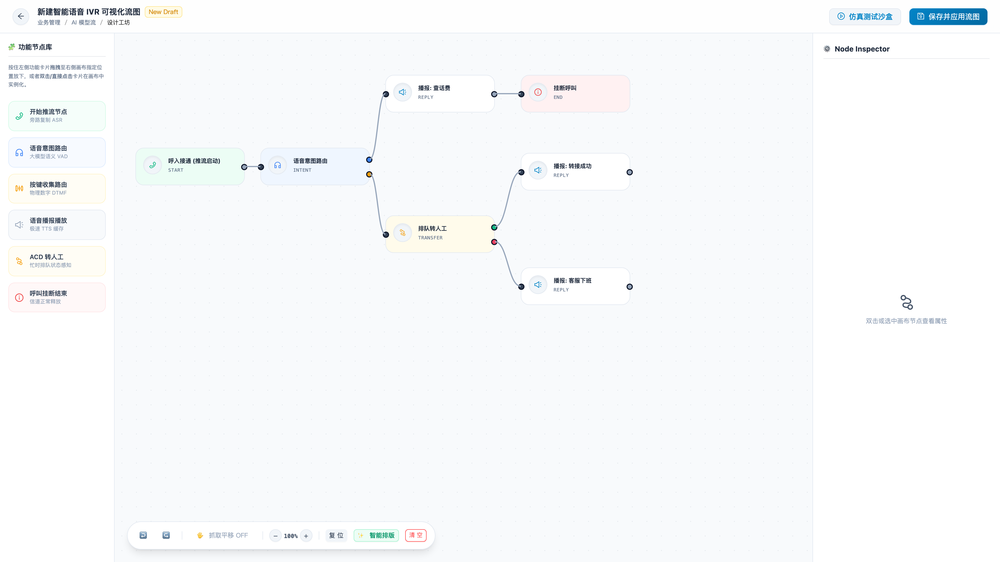 | 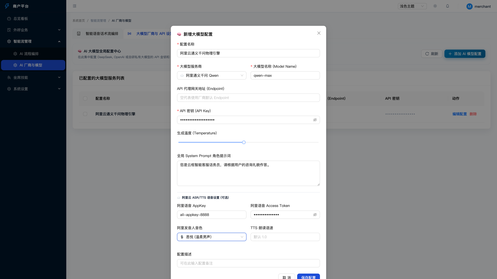 |
| *Supports neon charging effects and drag-and-drop IVR layout* | *Decoupled credentials and LLM parameter settings* |

| ⚙️ Start Node Auto-Fill Card |
| :---: |
| 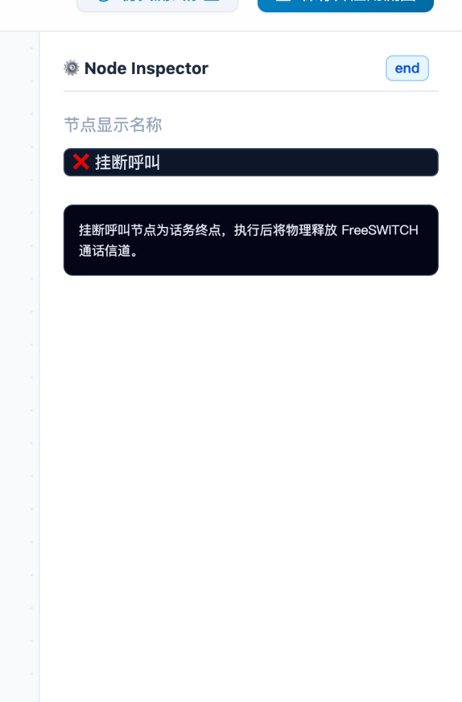 |
| *Form schema integration with automatic model settings mapping* |

#### Administration Dashboard Gallery (Operate Panel - `/operate`)
A view of the operator control interfaces:

| 📊 Telephony Analytics Dashboard | 🔌 Node Pool Heartbeat Monitor |
| :---: | :---: |
| 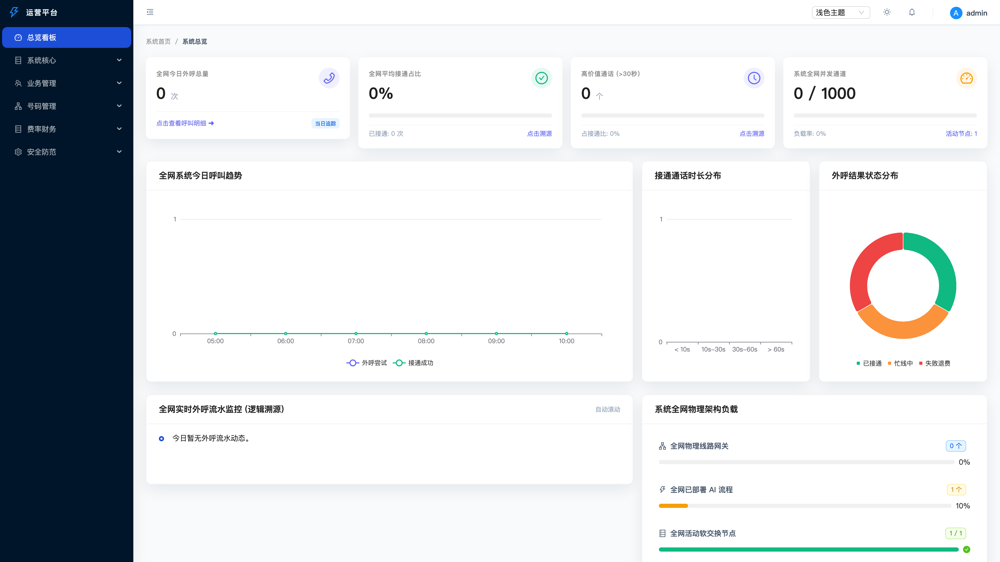 | 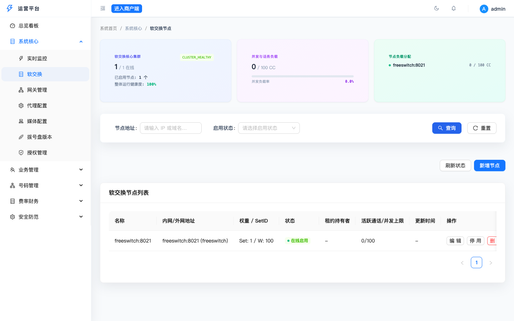 |
| *Outbound traffic statistics and global channel metrics* | *Active FreeSWITCH instance heartbeats and event lease states* |

| 🎛️ Inbound/Outbound SIP Gateways | 🏢 Billing Ledgers & Merchants |
| :---: | :---: |
| 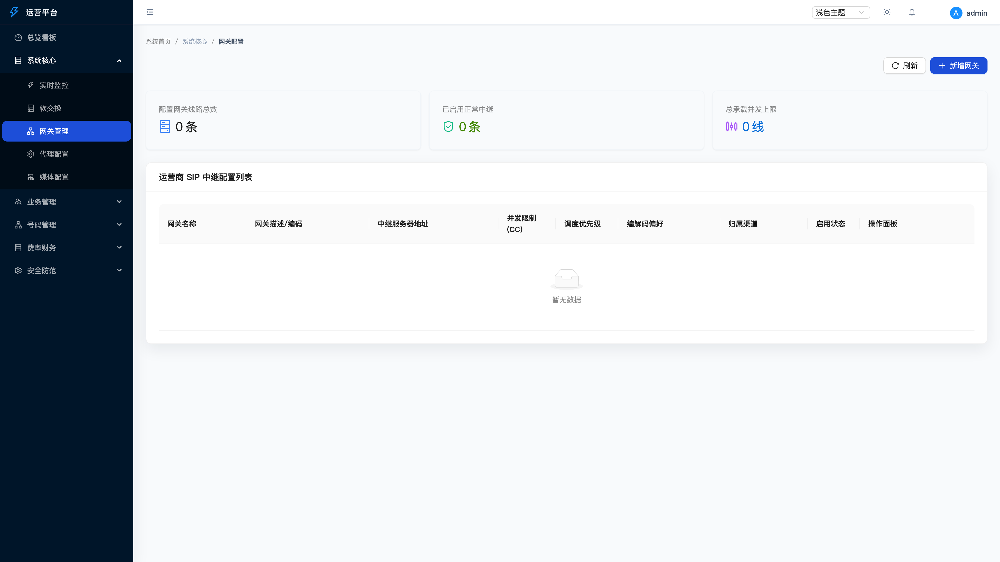 | 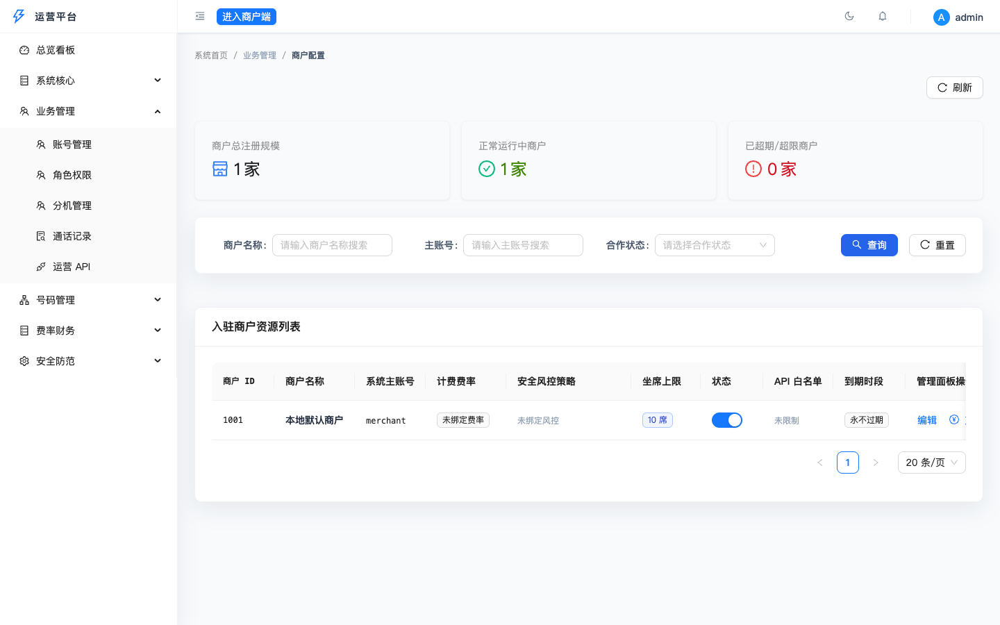 |
| *Trunk configuration and physical concurrency cap settings* | *Prepaid balances, account validation, and CDR audits* |

| ☎️ Multi-Tenant SIP Extensions | ⚙️ Selection Rules & Anti-Harassment |
| :---: | :---: |
| 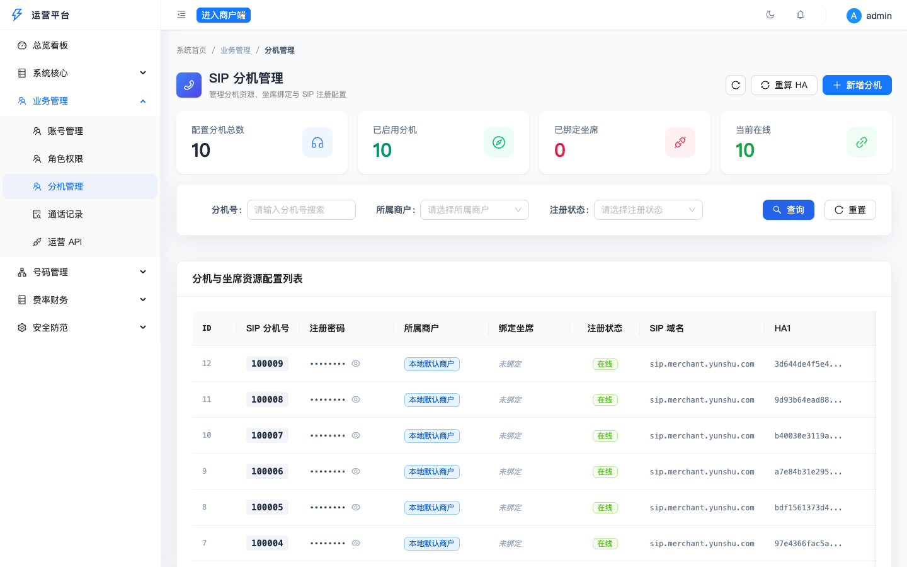 | 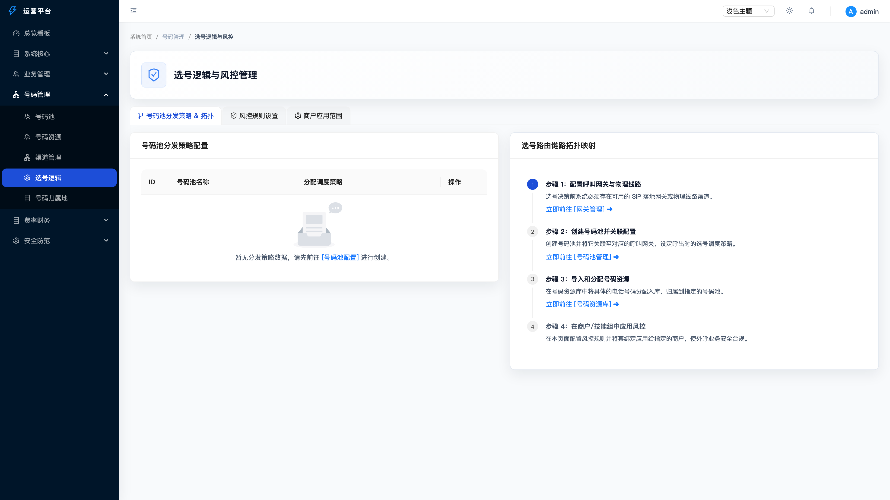 |
| *Extension provisioning, credentials, and online status monitors* | *Atomic caller routing, blind-spot filters, and blacklist checks* |

| 🛡️ Geofencing IP Firewall & Security Center |
| :---: |
| 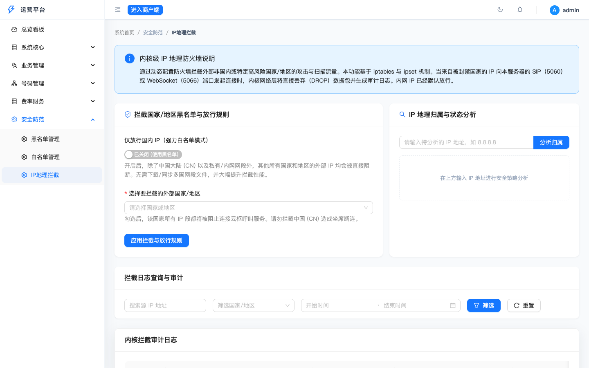 |
| *Country-level firewall blocking via iptables/ipset and audit log monitoring* |

#### Merchant Portal Gallery (Merchant Panel - `/merchant`)
Merchant workspace preview:

| 🚀 Batch Telephony Automation | 📞 WebRTC Companion Softphone |
| :---: | :---: |
| 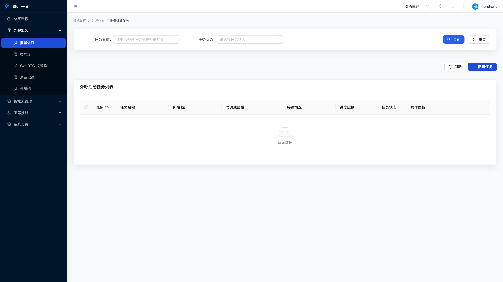 | 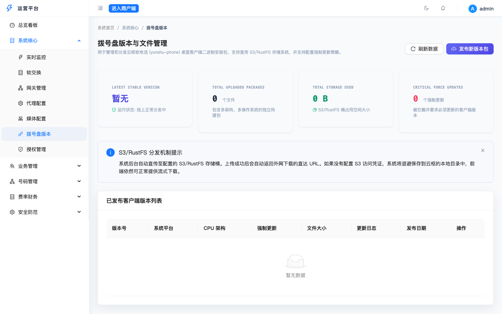 |
| *File importing, dialer scheduling, and task orchestration* | *Embedded WebRTC client for dialing directly from the browser* |

| 🎙️ Call History & Audio Auditing | 👥 Skill Groups & ACD Queues |
| :---: | :---: |
| 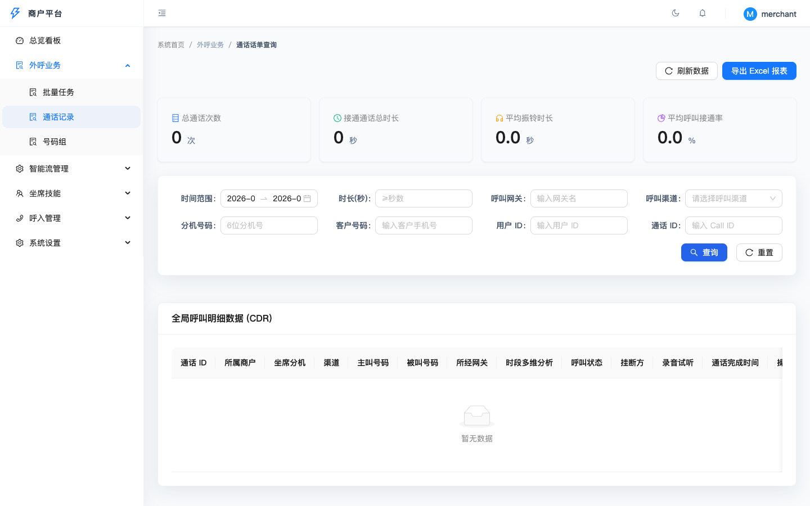 | 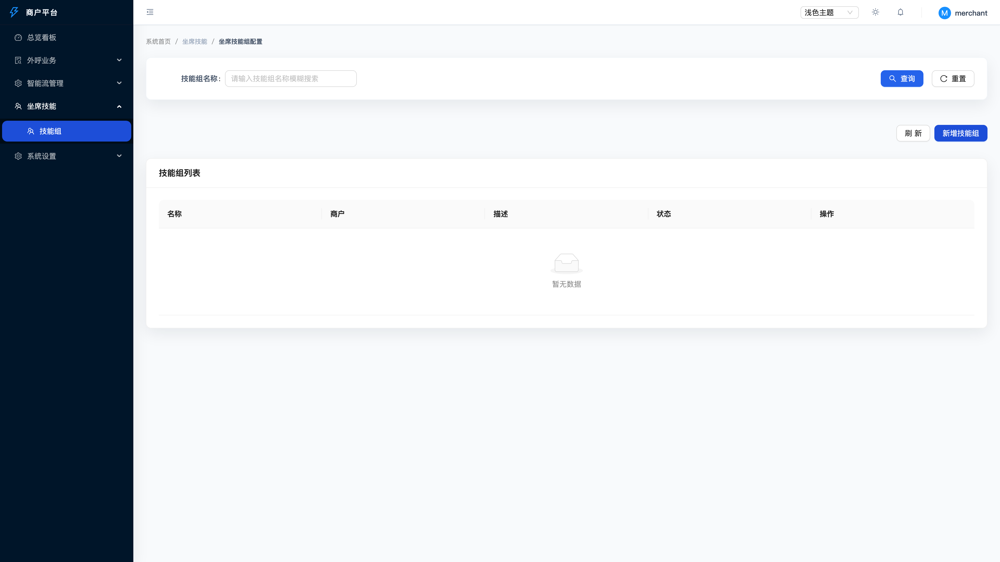 |
| *CDR tables with built-in audio players for recording inspection* | *Routing policies, queues, and agent status mapping* |

### WebSocket PCM Streaming & Low-Latency VAD Gateway
*   **RTP Audio Stream Bypass**: Integrates with FreeSWITCH `mod_audio_stream`. Upon arriving at ASR nodes, it issues `uuid_audio_stream` commands to push raw 16k mono 16-bit PCM frames to the WebSocket ASR server with <10ms delay.
*   **Go Audio Stream Receiver**: Handles binary RTP PCM WebSocket frames and performs Root Mean Square (RMS) decibel analysis.
*   **VAD Algorithm**: Uses Voice Activity Detection to capture talk start (allowing interruptions) and talk end (1.0s silence threshold) directly in Go.

### Strict Fail-Closed Execution (No Mock Fallbacks)
*   **Rigid Error Handlers**: Fails closed if API keys are missing, cloud services fail, or credentials are invalid. The engine immediately rejects mock simulations, hanging up call legs or transferring to live agents to protect production billings.
*   **Outbox-Backed Workers**: Pushes downstream CDRs via custom hooks with exponential backoffs and HMAC-SHA256 signatures, ensuring reliable deliveries.

### 🛡️ Dynamic Geo-Fencing & IP Firewall Daemon (`cc-firewall-guard`)
*   **Host-Level Network Block**: Integrates `cc-firewall-guard`, a host-level system security daemon that periodically syncs blocking configurations from Redis and dynamically updates kernel IP sets. It enforces host-level package dropping (`DROP`) for SIP (`5060`) and WebSocket (`5066`) ports.
*   **Dual Mode Geo-Fencing**:
    - **Blacklist Mode**: Blocks a list of user-selected high-risk country codes (ISO 2-letter codes, e.g. `US`, `DE`).
    - **"Only Allow CN" Whitelist Mode**: Whitelists only China (`CN`) and private loopback/private subnets (RFC 1918: `127.0.0.0/8`, `10.0.0.0/8`, `172.16.0.0/12`, `192.168.0.0/16`, `169.254.0.0/16`, `224.0.0.0/4`). All other international IP ranges are dropped. Bypasses downloading all 230+ country zone files, drastically improving firewall packet filtering lookup latency.
*   **Atomic Heat Swapping & Fail-Safe Protection**: Implements atomic `ipset swap` commands. It loads IP ranges into a temporary set and swaps it with the active set in a single kernel instruction to guarantee zero connection loss during configuration updates. Explicitly whitelists RFC 1918 private scopes to prevent administrator connection lockout.
*   **Adaptive Environment Detection (Dry-Run Mode)**: Runs in clean, no-op dry-run mode on macOS development environments without system rules modification. On Linux servers, it listens to kernel events via `journalctl --grep=SIP_BLOCK:` in real-time, matches blocked IPs to countries, and reports them back to `cc-console`'s Webhook to write audit logs.
*   **Interactive IP Diagnostics**: Provides a diagnostic dashboard in the console to inspect specific IP allocations, automatically convert ISO codes to beautiful indicator flag emojis, and determine their status (Allow, Blocked, Private Scope) under the current rules.

#### 🛡️ Country IP Firewall Daemon Network Flow & Audit Topology
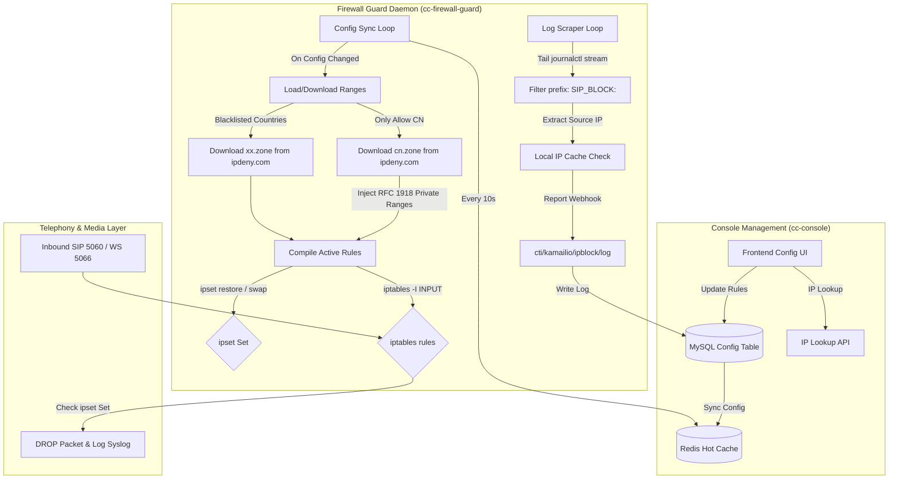

---

## 🚀 4. Production Deployment Roadmap & Configuration Guide

To guarantee telecom-grade high availability, sub-millisecond signaling latency, and seamless media file synchronization in production, you must adhere to the following deployment architecture recommendations and `production.yaml` configuration guidelines.

### 📡 4.1 Production Topology & Clustering

In a distributed production environment, Yunshu components must be grouped into distinct network boundaries and clustered for high availability:

```text
       DMZ / Public Zone [Firewall Filtered]        VPC Private Zone [Ultra-Low Latency, High-Speed Link]
    ┌──────────────────────┐        ┌────────────────────────────────────────────────────────┐
    │       cc-edge        ├───────►│    cc-console Cluster (2+ Nodes, Load Balanced)        │
    │ (Auth/Limit/Proxy)   │       │   ┌──────────────────────────────────────────────┐     │
    └──────────────────────┘        │   │                                              │     │
                                    │   ▼                                              ▼     │
                                    │ ┌───────────────┐                          ┌─────────┐ │
                                    │ │ MySQL Cluster │                          │  Redis  │ │
                                    │ │ (Primary/Sec) │                          │ Sentinel│ │
                                    │ └───────────────┘                          └────┬────┘ │
                                    │                                                 ▲      │
                                    │   ┌─────────────────────────────────────────────┘      │
                                    │   ▼                                                    │
                                    │ ┌───────────────┐   ESL Long Conn (<1ms) ┌────────────┐ │
                                    │ │    cc-call    ├─────────────────────►│ FreeSWITCH │ │
                                    │ │ (2+ Node Clu) │                      │ GW Cluster │ │
                                    │ └───────┬───────┘                      └─────┬──────┘ │
                                    │         │                                    │         │
                                    │         └──────────┐              ┌──────────┘         │
                                    │                    │Mount Shared  │                    │
                                    │                    ▼              ▼                    │
                                    │               ┌────────────────────────┐               │
                                    │               │   NFS / NAS Storage    │               │
                                    │               │ (TTS Cache & Recs)     │               │
                                    │               └────────────────────────┘               │
                                    │                            ▲                           │
                                    │                            │Mount Shared               │
                                    │                            │                           │
                                    │                      ┌─────┴──────┐                    │
                                    │                      │ cc-worker  │                    │
                                    │                      │ (2+ Nodes) │                    │
                                    │                      └────────────┘                    │
                                    └────────────────────────────────────────────────────────┘
```

#### 1. Microsecond Latency Constraint (VPC Network Planning)
- **Constraint**: Network latency between the signaling core (`cc-call`) and the FreeSWITCH media gateways must be **< 1ms**.
- **Planning**: Co-locate `cc-call` and FreeSWITCH inside the **exact same private VPC subnet**. For extremely high-concurrency environments, we strongly recommend deploying `cc-call` directly on the FreeSWITCH host as a system daemon, communicating over the local loopback interface (`127.0.0.1`) to eliminate any signaling race conditions.

#### 2. Scaling & Event Lease High Availability
- **`cc-call` Stateless Signaling Cluster**: Horizontally deploy 2+ instances of `cc-call`. To prevent multiple instances from racing or consuming the same FreeSWITCH ESL events redundantly, `cc-call` leverages a Redis-backed node registrar to dynamically claim a single active listener lease per FS node. If an instance fails, the lease expires and a standby instance takes over immediately.
- **`cc-worker` Distributed Task Processor**: Horizontally deploy 2+ instances of `cc-worker`. Outbox queue tasks (billing settlement, recording compression, downstream Webhook pushing) are claimed and processed by competing worker instances via the atomic `ClaimDue` lease mechanic, guaranteeing zero duplicate tasks and automatic failover.
- **Redis Sentinel & Persistent Storage**: Redis acts as the single source of truth for hot pathways (extension status, atomic balance checks, and double concurrency limits). It **MUST be deployed as a Sentinel or Redis Cluster** in production, with AOF persistence enabled to achieve sub-second state recovery.

#### 3. Low-Latency Shared Filesystem (TTS & Recordings)
- **TTS Cache**: `cc-call` synthesizes LLM voice answers and writes MP3 files locally. FreeSWITCH must playback these files via absolute paths instantly.
- **Recordings**: FreeSWITCH records dual-stream calls locally, and `cc-worker` must read them to transcode and upload to Alibaba Cloud OSS or Tencent Cloud COS.
- **Planning**: Enforce a low-latency **NFS / NAS shared volume** mapped to the **exact same absolute folder path** (e.g. `/var/lib/yunshu/shared`) across all FreeSWITCH, `cc-call`, and `cc-worker` hosts, with complete `r/w` permissions.

---

### ⚙️ 4.2 Production Config Guidelines (production.yaml)

For production environments, copy `configs/default.yaml` to `configs/production.yaml` and configure the following parameters to ensure performance and isolation:

```yaml
# =====================================================================
# 1. Relational Database & Connection Pool Optimization (MySQL)
# =====================================================================
database:
  # REQUIRED: Point to your production MySQL primary VIP with strong credentials
  dsn: "yunshu_prod:SecurePass123!@tcp(mysql-vip.prod.lan:3306)/yunshu?charset=utf8mb4&parseTime=True&loc=Local"
  # OPTIMIZATION: Tune connection pool sizes to handle high call volumes
  max_open_conns: 100        # Max active DB connections to avoid transactional waiting queues
  max_idle_conns: 20         # Max idle connections to minimize TCP socket recycle cost
  conn_max_lifetime: 3600    # Connection lifetime limit in seconds

# =====================================================================
# 2. Redis Cache & Concurrency Locking (Sentinel/Cluster)
# =====================================================================
redis:
  # REQUIRED: Point to your production Redis Sentinel VIP or cluster entry point
  addr: "redis-sentinel.prod.lan:6379"
  # REQUIRED: Strong production Redis password
  password: "RedisStrongPassword456$"
  db: 0
  pool_size: 150             # OPTIMIZATION: Scale up connection pool to support high-frequency Lua concurrent allocations

# =====================================================================
# 3. Edge Gateway Security & Access Control (cc-edge)
# =====================================================================
edge:
  port: 8080                 # Exposed proxy API port
  rate_limit:
    enable: true
    capacity: 200            # Enforced maximum bucket capacity (burst limit for outbound API per merchant)
    rate: 50                 # Token replenishment rate per second

# =====================================================================
# 4. FreeSWITCH ESL & Audio Stream Configurations
# =====================================================================
freeswitch:
  # REQUIRED: Enforce strong credentials for ESL (Do NOT use default ClueCon)
  esl_addr: "fs-node1.prod.lan:8021"
  esl_password: "FsSuperSecurePassword789!"
  # REQUIRED: Point mod_audio_stream websocket push target to the cc-call production IP
  audio_stream_ws: "ws://cc-call-internal-vip.prod.lan:9002/audio"

# =====================================================================
# 5. Shared Storage Path Mappings (TTS & Recording NFS Mounts)
# =====================================================================
storage:
  # REQUIRED: Shared NFS/NAS mount path, identical across all servers
  shared_root: "/var/lib/yunshu/shared"
  # REQUIRED: Shared path for TTS synthesis files
  tts_cache_dir: "/var/lib/yunshu/shared/tts_cache"
  # REQUIRED: Shared path matching FreeSWITCH recording destination
  recordings_dir: "/var/lib/yunshu/shared/recordings"

# =====================================================================
# 6. Async Worker & Downstream Webhook Pushing (cc-worker)
# =====================================================================
worker:
  billing:
    enable: true
    # WARNING: Fallback rate. Production billing enforces exact templates; unconfigured accounts trigger system warnings
    default_rate_per_min: 0.15 
  recording:
    enable: true
    oss_bucket: "yunshu-recordings-prod"
    oss_endpoint: "oss-cn-shenzhen.aliyuncs.com"
  downstream:
    # REQUIRED: Endpoint for pushing customer CDR data securely
    webhook_url: "https://api.merchant-platform.com/callbacks/cdr"
    # OPTIMIZATION: SHA256 signing secret for pushing validation
    signature_secret: "MerchantSecretKeySignatureXYZ"

# =====================================================================
# 7. Outbound Telecom-Grade Concurrency Orchestration (CTI Engine)
# =====================================================================
cti:
  concurrency:
    # WARNING: Redis selection locks lease duration (Recommend 30 mins to avoid locking leaks)
    claim_ttl_ms: 1800000 
    # REQUIRED: Enforce simultaneous double concurrency limitations (both Gateway and Phone levels)
    enable_double_limit: true
```

---

### 🛠️ 4.3 Step-by-Step Production Deployment Steps

#### Step 1: Initialize Network & Storage Volumes
1. Provision high-performance Linux hosts (Ubuntu 20.04+ / CentOS 7+).
2. Set up high-availability MySQL & Redis clusters.
3. Configure a low-latency **NFS/NAS shared file share**. Mount it under `/var/lib/yunshu/shared` on the FreeSWITCH, `cc-call`, and `cc-worker` hosts, granting full read/write permission (`chmod -R 777`).

#### Step 2: Configure FreeSWITCH Gateway
1. Edit `autoload_configs/event_socket.conf.xml` to restrict IP access and set a robust password.
2. Enable `mod_audio_stream` for WebSocket raw RTP PCM pushes.
3. Enforce the Shared Recording volume as the default destination for recording files (`/var/lib/yunshu/shared/recordings`).

#### Step 3: Build & Deploy Frontend (Nginx)
1. Build the static workspace inside `web/`:
   ```bash
   cd web
   npm install
   npm run build
   ```
2. Copy the resulting `dist/` directory to Nginx, routing fallback paths to `index.html`.

#### Step 4: Compile & Run Go Microservices
1. Compile Go binaries from the repository root:
   ```bash
   go build -o bin/cc-edge ./cmd/cc-edge
   go build -o bin/cc-console ./cmd/cc-console
   go build -o bin/cc-call ./cmd/cc-call
   go build -o bin/cc-worker ./cmd/cc-worker
   go build -o bin/cc-firewall-guard ./cmd/cc-firewall-guard
   ```
2. Copy `configs/default.yaml` to `configs/production.yaml` and configure it according to **4.2 Production Config Guidelines**.

#### Step 5: Enforce Systemd System Service Availability
1. Manage microservices using **Systemd** to achieve automatic recovery. For `cc-call` and `cc-firewall-guard` as examples:
   - Create `/etc/systemd/system/cc-call.service`:
     ```ini
     [Unit]
     Description=Yunshu CallCenter Telephony Engine
     After=network.target

     [Service]
     Type=simple
     User=root
     WorkingDirectory=/var/yunshu
     ExecStart=/var/yunshu/bin/cc-call -config /var/yunshu/configs/production.yaml
     Restart=always
     RestartSec=5
     LimitNOFILE=65535

     [Install]
     WantedBy=multi-user.target
     ```
   - Create `/etc/systemd/system/cc-firewall-guard.service` (The firewall guard daemon must run as root):
     ```ini
     [Unit]
     Description=Yunshu CallCenter IP Geofencing Firewall Guard Daemon
     After=network.target

     [Service]
     Type=simple
     User=root
     WorkingDirectory=/var/yunshu
     ExecStart=/var/yunshu/bin/cc-firewall-guard -config /var/yunshu/configs/production.yaml
     Restart=always
     RestartSec=5
     LimitNOFILE=65535

     [Install]
     WantedBy=multi-user.target
     ```
2. Reload system configurations with `systemctl daemon-reload` and start all services (including `cc-firewall-guard`), ensuring 24/7 self-healing and service reliability.

---

### 📡 4.4 Telecom-Grade VoIP Clustering (Kamailio + RTPEngine + FreeSWITCH)

In large-scale production environments carrying thousands of concurrent channels, Kamailio is deployed to manage SIP control signaling and routing, RTPEngine executes high-performance kernel-space RTP media forwarding and NAT traversal, and FreeSWITCH operates securely in the private VPC zone to run CTI IVR dialplans, capture audio streams via WebSockets (`mod_audio_stream`), and handle transcoding.

Here is the integration and configuration modification guide for the core VoIP clustering components:

#### 1. Kamailio SIP Proxy & Router Config (`kamailio.cfg`)
- **Role**: Handles frontend SIP registration, perimeter defense against SIP scanning attacks, and utilizes the `dispatcher` module to load balance calls across the backend FreeSWITCH gateway pool.
- **Key Modifications**:
  - **SIP Signal Bindings & Public IP Advertising (NAT Traversal) (`kamailio.cfg`)**:
    Under NAT/Cloud deployments, force Kamailio to listen to its private IP interface but advertise its public IP address for external SIP endpoints:
    ```kamailio
    # Bind to private interface and advertise public IP for NAT traversal
    listen=udp:<KAMAILIO_PRIVATE_IP>:5060 advertise <KAMAILIO_PUBLIC_IP>:5060
    ```
  - **Multi-Tenant SIP Digest Hashing Transformations (`kamailio.cfg`)**:
    When multi-domain tenant authentication is enabled, Kamailio scripts can leverage the MD5 transformation syntax (`{s.md5}`) to compute hashes on the fly and verify them against the pre-calculated keys stored in `cc_res_extension` table:
    ```kamailio
    # Kamailio routing script variables mapping and MD5 transformation syntax
    $var(ha1_v) = $var(username) + ":" + $var(domain) + ":" + $var(password);
    $var(ha1b_v) = $var(username) + "@" + $var(domain) + ":" + $var(domain) + ":" + $var(password);
    $var(ha1) = $(var(ha1_v){s.md5});
    $var(ha1b) = $(var(ha1b_v){s.md5});
    ```
  - **Enable auth_db Multi-Domain & HA1b Authentication Support (`kamailio.cfg`)**:
    To allow Kamailio to query the renamed `cc_res_extension` table and authenticate users using the pre-computed HA1b hashes, configure the `auth_db` module as follows:
    ```kamailio
    # Load authentication modules
    loadmodule "auth.so"
    loadmodule "auth_db.so"

    # 1. Disable local plaintext password hashing (must be 0 since the database stores pre-calculated GORM hashes)
    modparam("auth_db", "calculate_ha1", 0)
    # 2. Map target hash columns (ha1 for domain-less auth, ha1b for multi-tenant domain-bound auth)
    modparam("auth_db", "password_column", "ha1")
    modparam("auth_db", "password_column_2", "ha1b")
    # 3. Enable multi-domain filtering in SELECT queries
    modparam("auth_db", "use_domain", 1)

    # 4. Map the renamed Yunshu extension table attributes (Note: table name "cc_res_extension" must be passed as an argument in auth_check("$fd", "cc_res_extension", "1"))
    modparam("auth_db", "user_column", "extension_number")
    modparam("auth_db", "domain_column", "sip_domain")
    ```
  - **Backend Gateway List (`dispatcher.list`)**:
    Map your hidden FreeSWITCH nodes (using their private IP addresses) and configure SIP OPTIONS pinging to monitor node health dynamically:
    ```text
    # setid(1) targets the active backend FreeSWITCH pool using internal private IPs
    1 sip:<FREESWITCH1_PRIVATE_IP>:5060 0 0 weight=50
    1 sip:<FREESWITCH2_PRIVATE_IP>:5060 0 0 weight=50
    ```
  - **RTP Media Relay Integration (`kamailio.cfg`)**:
    Intercept SDP payloads in the signaling flow and call RTPEngine to hijack media ports and manage NAT relays:
    ```kamailio
    # Load rtpengine module
    loadmodule "rtpengine.so"
    modparam("rtpengine", "rtpengine_sock", "udp:<RTPENGINE_PRIVATE_IP>:22222") # Address of RTPEngine private UDP socket

    # Handle SDP in your routing blocks
    route[MANAGE_MEDIA] {
        if (is_request() && has_body("application/sdp")) {
            rtpengine_manage("trust-address replace-origin replace-session-connection");
        } else if (is_reply() && has_body("application/sdp")) {
            rtpengine_manage("trust-address replace-origin replace-session-connection");
        }
    }
    ```

#### 2. RTPEngine Media Forwarder Config (`rtpengine.conf`)
- **Role**: Kernel-level UDP packet relay forwarding to resolve NAT and firewall traversal for public-to-private connections.
- **Key Modifications (`/etc/rtpengine/rtpengine.conf`)**:
  - **Dual Network Interface Binding**: Bind external and internal network interfaces to route traffic securely:
    ```ini
    interface = internal/<RTPENGINE_PRIVATE_IP>;external/<RTPENGINE_PUBLIC_IP>
    ```
  - **UDP NG Control Port**: Set the listener to match Kamailio's `rtpengine_sock` parameter:
    ```ini
    listen-ng = <RTPENGINE_PRIVATE_IP>:22222
    ```
  - **UDP Port Range Allocation**: Keep the RTP UDP port allocation pool wide enough to support high concurrent streams:
    ```ini
    port-min = 30000
    port-max = 40000
    ```

#### 3. FreeSWITCH Cluster Node Configuration (Private Subnet)
- **Role**: Runs pure IVR state machines, call recording, audio transcribing, and streaming.
- **Key Modifications**:
  - **Deactivate External SIP Registration Authentication**:
    Since Kamailio already enforces authentication at the edge, configure FreeSWITCH's internal profile (e.g. `sofia.conf.xml`) to blindly accept incoming requests from Kamailio to reduce signaling overhead:
    ```xml
    <!-- internal.xml -->
    <param name="accept-blind-reg" value="true"/>
    <param name="accept-blind-auth" value="true"/>
    <param name="apply-inbound-acl" value="kamailio-nodes"/>
    ```
  - **White-List Kamailio via Access Control (`acl.conf.xml`)**:
    Reject any SIP requests that do not originate from the Kamailio cluster:
    ```xml
    <list name="kamailio-nodes" default="deny">
      <node type="allow" cidr="10.0.10.0/24"/>
    </list>
    ```
  - **Bypass Media vs. Active Media IVR Routing**:
    For direct agent-to-customer bridge calls that require no IVR or recording, apply `bypass_media` in Kamailio routing to allow RTPEngine to relay RTP packets directly (enabling thousands of concurrent calls per box). However, for **AI IVR/conversational voice flows** managed by the Yunshu engine, **you MUST route the media locally through FreeSWITCH** to allow ASR PCM streaming (`mod_audio_stream`) and native VAD break-ins.
  - **SIP Profile NAT Mapping & Network Boundary Segregation**:
    When FreeSWITCH is deployed behind NAT (only binding to private IP interfaces) and needs to interface with external networks, you must explicitly declare the public IP address. Failure to do so will result in FreeSWITCH exposing its internal IP in the SIP/SDP headers, causing "one-way audio" or "complete silence" issues:
    *   **External Communications (`sip_profiles/external.xml`)**: Designed to interface with external SIP endpoints (e.g., remote softphone agents or carrier gateways):
        ```xml
        <!-- Replace values with your actual external public IP -->
        <param name="ext-rtp-ip" value="<YOUR_PUBLIC_IP>"/>
        <param name="ext-sip-ip" value="<YOUR_PUBLIC_IP>"/>
        ```
    *   **Internal Communications (`sip_profiles/internal.xml`)**: Designed for trusted internal networks (e.g., matching the same VPC as the Kamailio proxy) while translating addresses correctly when launching calls outbox:
        ```xml
        <!-- 1. Bind listener interfaces to internal addresses -->
        <param name="rtp-ip" value="$${local_ip_v4}"/>
        <param name="sip-ip" value="$${local_ip_v4}"/>
        <!-- 2. Force outbound SIP and SDP packets to map to public address for NAT traversal -->
        <param name="ext-rtp-ip" value="<YOUR_PUBLIC_IP>"/>
        <param name="ext-sip-ip" value="<YOUR_PUBLIC_IP>"/>
        ```

---

## 📂 5. Physical Project Directory Structure

```text
├── cmd/                        # Executable entry points for independent microservices
│   ├── cc-call/                # CTI ESL telephony engine
│   ├── cc-console/             # Operations and tenant admin panel server
│   ├── cc-worker/              # Async distributed workers
│   ├── cc-edge/                # Edge authentication and rate limiting proxy
│   ├── cc-firewall-guard/      # IP Geofencing Firewall guard daemon
│   ├── cc-all/                 # All-in-One combined runtime daemon
│   └── update-agents/          # Generated contract updates builder
├── internal/
│   ├── app/                    # Dependency injection bindings & shared Gin engines
│   ├── domain/                 # Pure domain layer (Independent of ORM/Redis)
│   │   ├── callflow/           # AIVoiceEngine IVR flow execution
│   │   ├── cti/                # ACD selection, selection rules & concurrency locking
│   │   ├── esl/                # Event socket state machine and call lifecycles
│   │   └── operate/            # Flow charts, billing template entities
│   ├── transport/              # Transport adapters (Gin handlers, Redis Stream consumers)
│   ├── contracts/              # Shared event envelopes, error definitions, Redis keys
│   └── infra/                  # GORM repositories, Outbox SQL queues, Redis adapters
├── pkg/                        # Framework-agnostic modules (Locks, state registers)
├── web/                        # Vite + React flow workspace
└── docs/                       # Architecture drafts and sync migration decisions
```

---

## 🛠️ 6. Running Locally

### 1. Requirements
*   **Go**: `>= 1.21`
*   **NodeJS**: `>= 18`
*   **MySQL**: `>= 5.7`
*   **Redis**: `>= 6.0`

### 2. Launch Client UI
```bash
cd web
npm install
npm run dev
```

### 3. One-Click Combined Backend Daemons (All-in-One Mode)
Yunshu offers a combined process (`cc-all`) which pulls up all four microservices (`cc-edge`, `cc-console`, `cc-call`, `cc-worker`) inside a single shell instance:
```bash
# Clone the config file and edit connection details
cp configs/default.yaml configs/local.yaml

# Startup cc-all sharing local parameters
go run ./cmd/cc-all -config configs/local.yaml
```

### 4. Deployment Modes: Private Deployment (Single-Merchant) vs. SaaS Multi-Tenant Mode

Yunshu supports both **Private Deployment (Single-Merchant Mode)** and **SaaS Multi-Tenant Mode** out of the box. You can control this behavior via the configuration file (`configs/default.yaml` or `configs/production.yaml`):

```yaml
tenant:
  mode: "single"             # Options: "single" (Private Deployment / Single-Merchant) or "multi" (SaaS Mode)
  defaultMerchantId: 1001    # Default merchant ID used for private context fallback
```

#### 📊 Core Differences at a Glance

| Feature / Dimension | 🏢 Single-Merchant Mode (Private Deployment) | ☁️ SaaS Multi-Tenant Mode (Commercial Platform) |
| :--- | :--- | :--- |
| **Primary Use Case** | Internal corporate customer centers, private enterprise setups, standalone operations. | Commercial SaaS platform hosting, cloud call center provider. |
| **Merchant Identity** | Session/API context automatically falls back to `defaultMerchantId` (`1001`). | Explicit merchant selection, authorization validation, and separate billing. |
| **Console Boundaries** | SaaS boundaries (tenant dropdowns, merchant registration/deletion) are hidden or locked. | Full merchant CRUD, subscription lifecycle, and domain isolation panels enabled. |
| **Data Partitioning** | Global data access within a single database instance without strict tenant separation. | Strict logical partitioning by `merchant_id` across databases, caches, and flows. |
| **SIP Authentication** | Single SIP domain authentication. No domain-binding required for local extensions. | Multi-domain isolation (Kamailio `use_domain=1`). Extensions authenticate via `ha1b`. |
| **Billing & Payments** | Billing can be optional (no overdraft lockouts). Mostly for traffic auditing. | Strict real-time billing, Redis Lua overdraft lockouts, and asynchronous ledger settling. |
| **Resource Routing** | Inbound dialing pools and ACD queues automatically route to the default merchant. | Telco trunking, number pools, and agent queues must be explicitly allocated to tenants. |

---

#### 🏢 Single-Merchant Mode (Private Enterprise Deployment)
Designed for internal corporate customer centers or private setups:
*   **Automatic Identity Fallback**: Console sessions and API outbounds automatically resolve to the specified `defaultMerchantId` (defaulting to `1001`), bypassing tenant selection grids.
*   **Hidden SaaS Boundaries**: Tenant selector dropdowns, multi-tenant workspace partitioning, and merchant management are hidden or locked in the user interface, optimizing workspace layout for internal teams.
*   **Simplified Inbound Routing**: Dialing pools, ACD routing queues, and SIP domains automatically link to the default merchant context.
*   **Pre-seeded Seeding**: If the default merchant configuration is missing during system initialization, database seed managers automatically generate a default merchant profile and provision dynamic AppKey/Secret pairs for developer integration.

#### ☁️ SaaS Multi-Tenant Mode
When `tenant.mode` is set to `"multi"`, the system activates multi-tenant isolation:
*   **Strict Multi-Tenant Isolation**: distinct merchants configure independent extensions, call gateways, AI prompt workflows, and credit accounts, securely partitioning data across concurrent routing paths.
*   **Multi-Domain SIP Registration**: Kamailio registers and authenticates terminals using **HA1b** (`MD5(username@domain:realm:password)`), allowing different merchants to use identical extension numbers (e.g., `1001`) on different SIP domains without conflict.
*   **Commercial Ledger & Anti-Overdraft**: Real-time balance deductions, prepaid packages, and rate cards are strictly validated per merchant, failing-closed on balance exhaustion.

---

## 🗺️ 7. Development Roadmap

Yunshu is actively refactoring legacy call center logic into the high-performance Go microservice framework. The following checklists detail our milestones:

### Phase 1: Robust AI Engine Adapter Separation [100% Completed]
*   ✅ **Centralized Credentials Provider**: Managed models and API endpoints in GORM and database tables.
*   ✅ **Decoupled Workflow Fields**: Eliminated mock LLM options from UI dropdowns and unified forms.
*   ✅ **Capacity Check Self-Reflection**: Allowed services to check implementation before exposing routes.
*   ✅ **Strict Fail-Closed Execution**: Prevented mock fallbacks to guarantee production billing logic safety.
*   ✅ **IP Geofencing Firewall Daemon (`cc-firewall-guard`)**: Dynamic host-level blocking via iptables/ipset, "Only Allow CN" whitelist mode, RFC 1918 security inclusion, and syslog automatic log auditing.

### Phase 2: Selection Concurrency & Event Registries [In Progress]
*   ✅ **Double Concurrency Atomicity**: Evaluated concurrent allocations on both Gateway and Extension levels natively in Redis Lua scripts.
*   ⏳ **Stateless ESL Lease Dispatcher**: Coordinated Event Socket listener leases among multi-instance telephony nodes.
*   📅 **Early Media / Progress Control**: Visual ACD IVR nodes managing media channels before call leg bridges.

### Phase 3: Transaction Billing Workflows [Planned]
*   ✅ **Durable CDR Outbox**: Buffered raw session events in reliable local database transactional outbox queues.
*   ⏳ **Distributed Pricing Processors**: Decoupled tariff matching from critical call paths using dedicated workers.
*   ⏳ **Real-Time Prepaid Safe-Lock**: Applied Redis Lua credits locking to mitigate balance deficits during active dialogs.

### Phase 4: Async Compression & Notification Webhooks [In Progress]
*   ✅ **ClaimDue Outbox Workers**: Competing daemon consumers claiming outbox events safely via DB locks.
*   ✅ **Verified downstream Webhooks**: Cryptographically signed callback alerts with SHA256 tokens and backoffs.
*   ⏳ **Media Compression & OSS Uploads**: Scanned and compressed audio records locally, pushing to cloud buckets asynchronously.

### Phase 5: Dynamic Auth & Operations ACLs [In Progress]
*   ✅ **Dynamic RBAC Schema**: Outlined console permission mappings and routes database models.
*   ⏳ **RBAC Middleware Filters**: Load operating agent privileges from database profiles for console route evaluation.

---

## ⚖️ 8. Apology & Disclaimer

### Individual Developer Status
Yunshu is an **open-source refactoring project written and maintained by a single developer. It is not affiliated with any commercial company, carrier network, or enterprise entity.** All architecture rewrites and manuals are published on a voluntary basis. Because of this personal open-source nature, we do not provide enterprise-grade SLAs, commercial billing, or on-site consulting.

### Support Commitments
Since the system is in active development, certain advanced features are under iteration. We apologize for any temporary bugs during your evaluation.

**SLA Support Resolutions**:
- **Response**: We commit to replying to GitHub Issues or bugs within **2 Hours**.
- **Fixes**: Bug fixes are developed and checked in within **24 Hours** for simple errors, and workarounds or patches are delivered within **48 Hours** for complex ESL signaling issues.

### Disclaimer
1. **Compliance**: Yunshu is built for enterprise inbound and outbound customer interaction centers. **You must comply with your region's telecom and privacy regulations**. The developer team assumes no liability for illegal telemarketing, harassment, or data leakages caused by misuse.
2. **Generative Model AI Outputs**: Conversation nodes rely on third-party LLMs (DeepSeek, OpenAI, Tencent, etc.). **We do not guarantee the correctness or appropriateness of generative replies**. Merchants must implement safe ACD human-transfers and hangups.
3. **No Warranties**: This open-source software is licensed under **GPL-3.0** "as-is", without warranties of any kind.

---

## 📄 9. License

This repository is published under the **[GNU General Public License v3.0 (GPL-3.0)](LICENSE)**. See the [LICENSE](LICENSE) file for more information.
