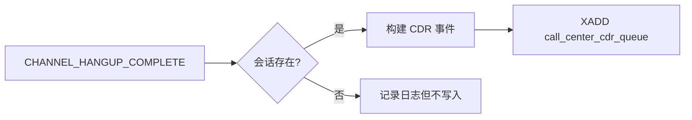
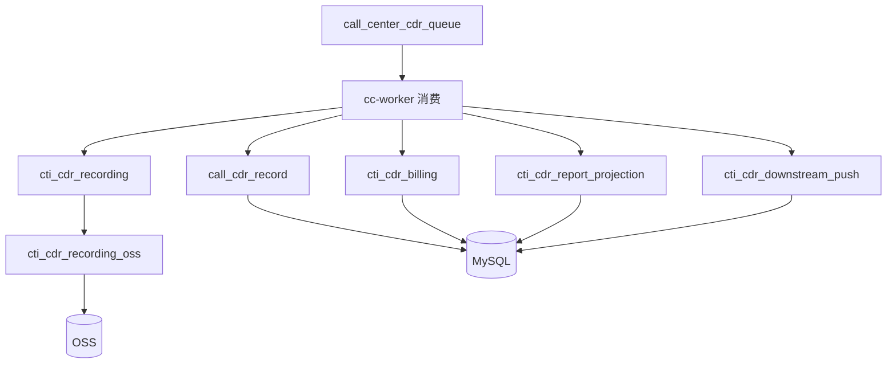
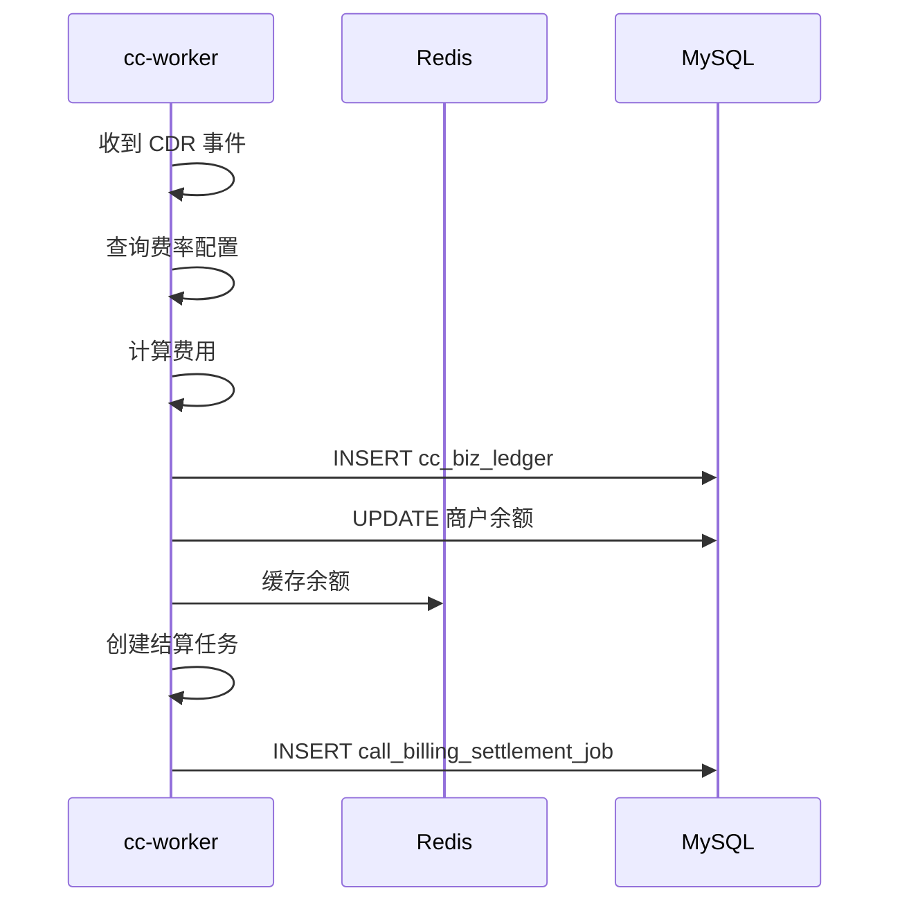
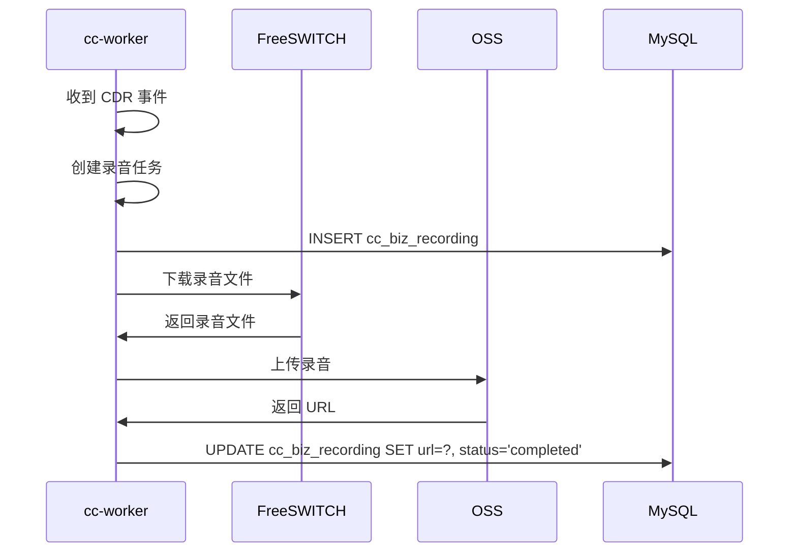
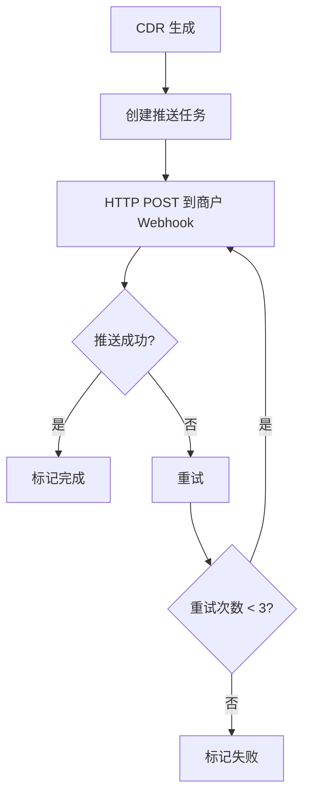

# 通话记录与计费

云枢声讯采用 Outbox 模式保证通话记录必达，并提供完整的计费、录音、报表和推送功能。

---

## CDR 生成规则

只要呼叫经过云枢声讯并进入会话生命周期，最终收到：
```text
CHANNEL_HANGUP_COMPLETE
```

就会写入：


**Redis Stream：**
```text
call_center_cdr_queue
```

---

## 后置流程



**详细流程：**
```text
call_center_cdr_queue
  → call_cdr_record
  → cti_cdr_billing
  → cti_cdr_recording
  → cti_cdr_report_projection
  → cti_cdr_downstream_push
  → cti_cdr_recording_oss
```

---

## 关键表

| 表 | 说明 |
| --- | --- |
| `call_cdr_record` | 主通话记录 |
| `cc_biz_ledger` | 计费流水 |
| `call_billing_settlement_job` | 结算任务 |
| `cc_biz_recording` | 录音任务 |
| `call_report_projection` | 报表投影 |
| `call_downstream_push_job` | 下游推送任务 |

---

## CDR 结构

**call_cdr_record 示例：**
```json
{
  "id": 10001,
  "call_id": "call-123456",
  "merchant_id": 1,
  "user_id": 2094,
  "caller": "01088886666",
  "callee": "13800001111",
  "direction": "outbound",
  "profile": "api_direct",
  "status": "answered",
  "start_time": "2024-06-10T10:00:00Z",
  "answer_time": "2024-06-10T10:00:05Z",
  "end_time": "2024-06-10T10:02:30Z",
  "duration": 150,
  "bill_duration": 145,
  "recording_url": "https://oss.example.com/recordings/xxx.wav",
  "created_at": "2024-06-10T10:02:31Z"
}
```

---

## 计费流程



**计费规则：**
- 按通话时长计费
- 支持不同费率套餐
- 支持阶梯定价
- 支持分钟/秒计费

---

## 录音流程



---

## 下游推送



**推送内容示例：**
```json
{
  "eventType": "cdr_created",
  "data": {
    "callId": "call-123456",
    "caller": "01088886666",
    "callee": "13800001111",
    "startTime": "2024-06-10T10:00:00Z",
    "duration": 150,
    "recordingUrl": "https://oss.example.com/recordings/xxx.wav"
  },
  "timestamp": 1718000000
}
```

---

## 测试保证

`internal/domain/esl/session_test.go` 中覆盖所有核心 profile 的 CDR 必达测试：

| Profile | 测试覆盖 |
| --- | --- |
| api_direct | ✅ |
| api_outbound | ✅ |
| inbound | ✅ |
| batch_outbound | ✅ |
| batch_predictive | ✅ |
| batch_synergy | ✅ |

---

## 相关代码索引

| 功能 | 文件位置 |
| --- | --- |
| CDR Outbox | `internal/domain/esl/session.go` |
| CDR 消费者 | `internal/domain/cdr/cdr_consumer.go` |
| 计费服务 | `internal/domain/billing/billing_service.go` |
| 录音服务 | `internal/domain/recording/recording_service.go` |
| 报表投影 | `internal/domain/report/report_projection.go` |
| 下游推送 | `internal/domain/push/downstream_push_service.go` |
