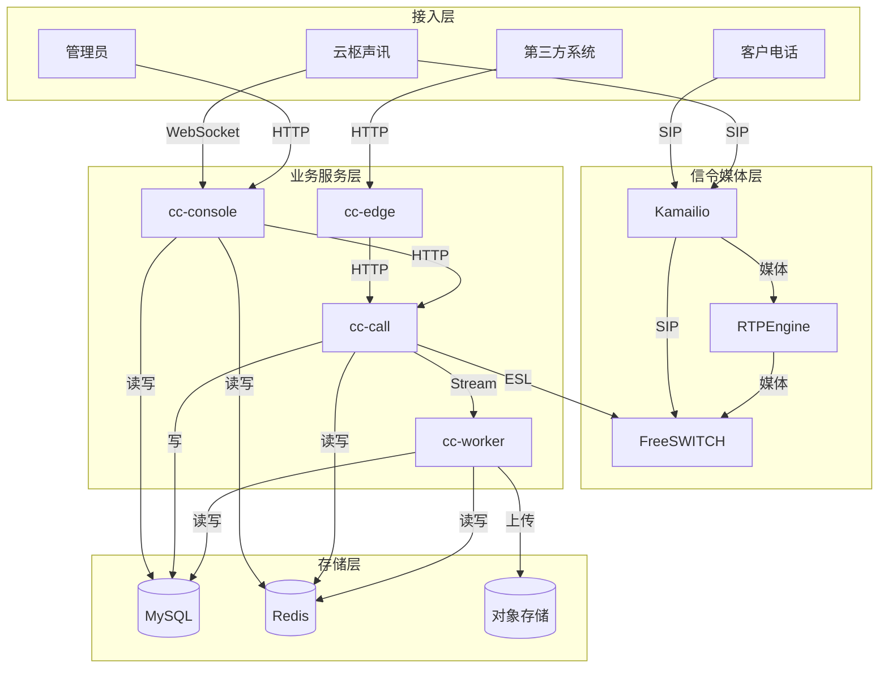
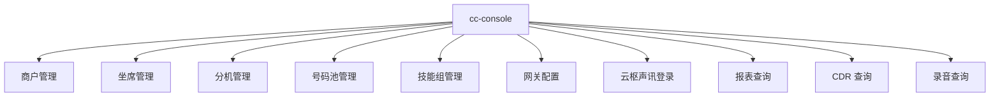
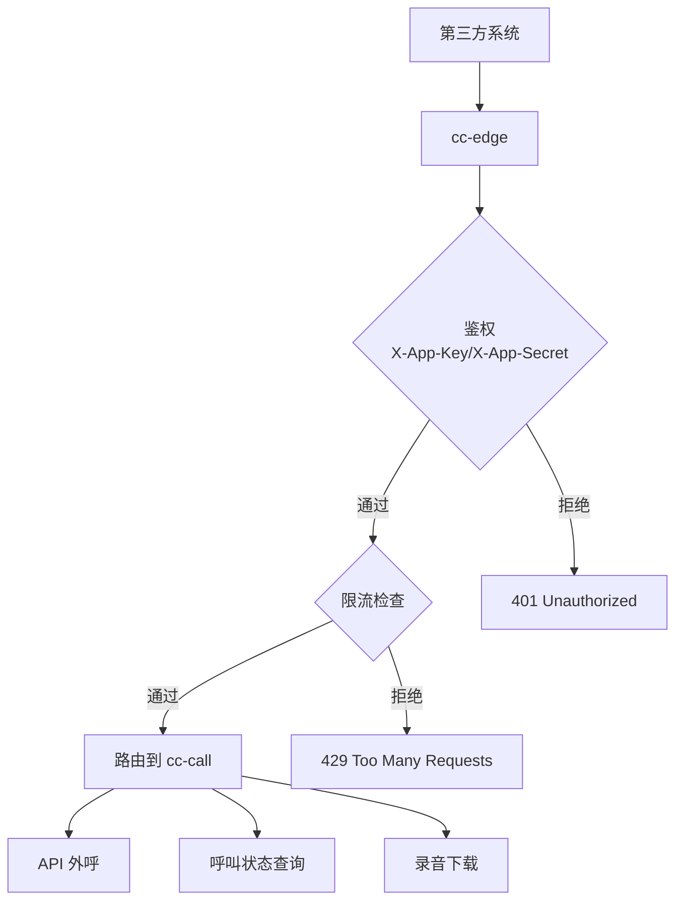
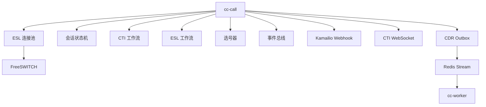
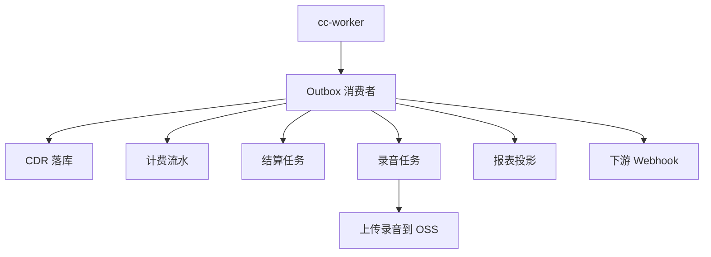
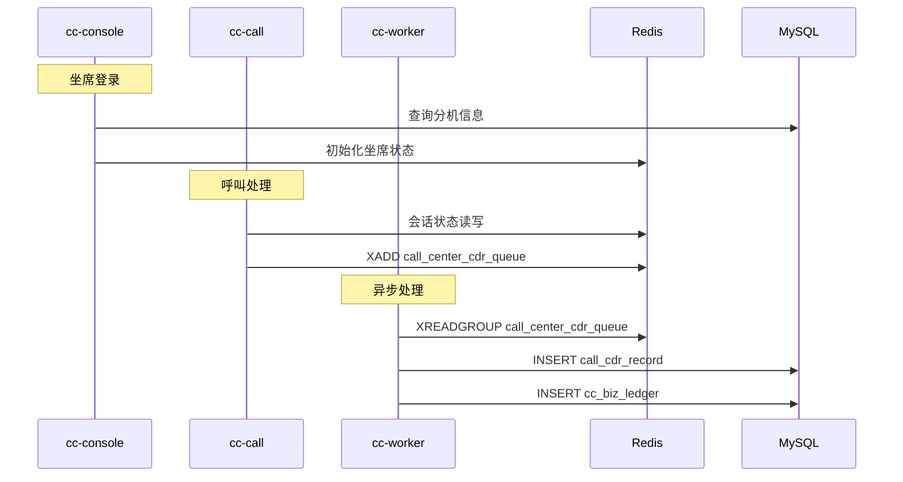
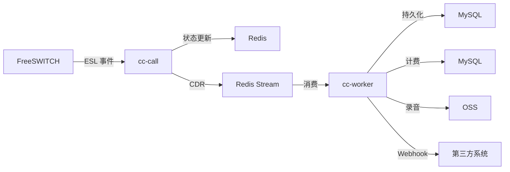

# 服务边界

云枢声讯采用微服务架构，将不同功能划分为独立服务，职责清晰，便于扩展和维护。

---

## 总体架构图

---

## cc-console

**职责：**
- 运营后台
- 商户后台
- 云枢声讯配套接口
- 分机、号码池、技能组、网关配置

**API 范围：**

**端口：** `8080`

---

## cc-edge

**职责：**
- 外部 API 网关
- 商户鉴权
- 限流
- 反向代理

**端口：** `8081`

---

## cc-call

**职责：**
- CTI 选号
- FreeSWITCH ESL 连接
- 呼叫会话状态机
- Kamailio webhook
- CTI WebSocket
- 呼入/呼出/批量流程编排

**端口：** `8082`

---

## cc-worker

**职责：**
- Outbox 投递
- CDR 落库
- 计费流水
- 结算
- 录音任务
- 报表投影
- 下游 webhook

**端口：** `8083`

---

## 服务间通信

---

## 数据流向

---

## 相关代码索引

| 服务 | 启动入口 |
| --- | --- |
| cc-console | `cmd/cc-console/main.go` |
| cc-edge | `cmd/cc-edge/main.go` |
| cc-call | `cmd/cc-call/main.go` |
| cc-worker | `cmd/cc-worker/main.go` |
| 一键启动（开发） | `cmd/cc-all/main.go` |
