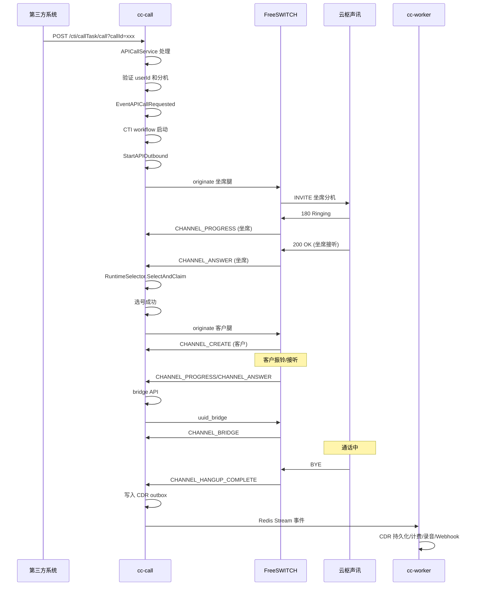
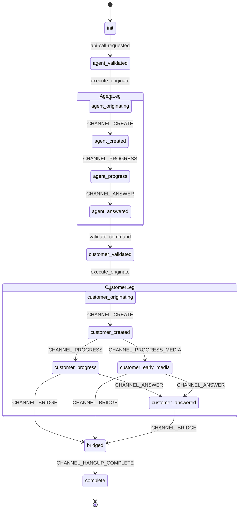
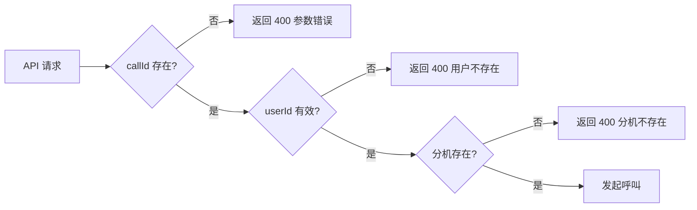

# API 外呼

API 外呼适合第三方系统或业务后台主动发起呼叫。

---

## 1. API 入口

```http
POST /cti/callTask/call?callId=<call-id>
Host: cc-call:8082
Content-Type: application/json

{
  "userId": 2094,
  "callee": "13800001111"
}
```

**请求参数：**
| 参数 | 类型 | 必填 | 说明 |
| --- | --- | --- | --- |
| callId | string | 是 | 调用方生成的唯一呼叫 ID |
| userId | int64 | 是 | 坐席用户 ID |
| callee | string | 是 | 被叫号码 |

**响应示例：**
```json
{
  "code": 0,
  "message": "success",
  "data": {
    "callId": "call-123456",
    "status": "initiated"
  }
}
```

---

## 2. 处理流程



**详细流程：**
```text
HTTP API
  → APICallService
  → EventAPICallRequested
  → CTI workflow
  → StartAPIOutbound
  → 坐席腿 originate
  → 坐席 ready 后选号
  → 客户腿 originate
  → bridge
  → CDR outbox
```

---

## 3. 状态机



---

## 4. 注意事项

- **必须传 `callId`**，否则会被视为请求参数不完整。
- `userId` 必须对应有效商户用户和有效分机。
- 生产环境建议通过 `X-App-Key / X-App-Secret` 做商户鉴权。
- API 外呼是 **Agent-First** 语义：先呼坐席，再呼客户。



---

## 5. 回调通知

可选配置 Webhook 接收呼叫状态变更：

```http
POST /your/webhook/endpoint
Content-Type: application/json

{
  "callId": "call-123456",
  "eventType": "call_initiated",
  "timestamp": 1718000000,
  "data": {
    "userId": 2094,
    "callee": "13800001111",
    "status": "ringing"
  }
}
```

**事件类型：**
| 事件 | 说明 |
| --- | --- |
| call_initiated | 呼叫已发起 |
| agent_ringing | 坐席振铃 |
| agent_answered | 坐席接听 |
| customer_ringing | 客户振铃 |
| customer_answered | 客户接听 |
| bridged | 双方通话 |
| hangup | 呼叫结束 |

---

## 6. 错误码

| code | message | 说明 |
| --- | --- | --- |
| 0 | success | 成功 |
| 400 | bad_request | 请求参数错误 |
| 401 | unauthorized | 未授权 |
| 404 | user_not_found | 用户不存在 |
| 404 | extension_not_found | 分机不存在 |
| 409 | call_already_exists | callId 已存在 |
| 500 | internal_error | 系统内部错误 |

---

## 7. SIPp 验证

```bash
bash scripts/sipp/run_e2e_tests.sh api
```

成功进入云枢声讯时应看到：
```text
API 响应: HTTP 200
```

---

## 8. 相关代码索引

| 功能 | 文件位置 |
| --- | --- |
| API 入口 | `internal/transport/http/cti/call_task_routes.go` |
| API 呼叫服务 | `internal/domain/callflow/api_call_service.go` |
| ESL 工作流定义 | `internal/domain/esl/workflows.go` |
| 呼出编排 | `internal/domain/esl/originate.go` |
| 事件消费者路由 | `internal/domain/callflow/consumer.go` |
