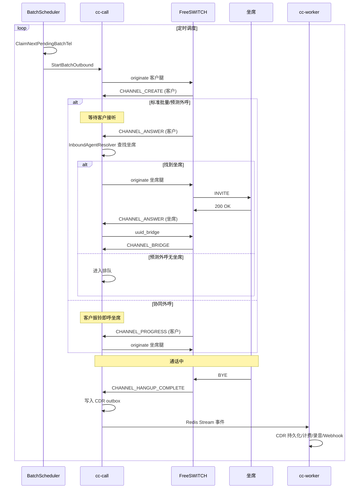
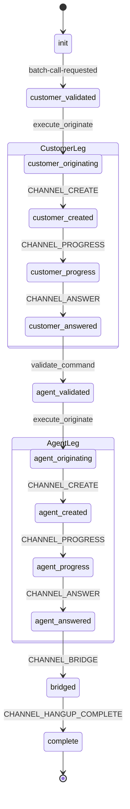
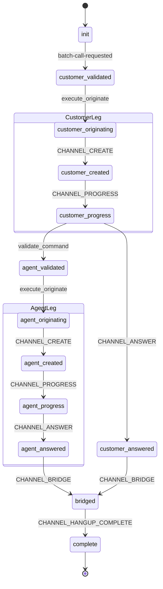
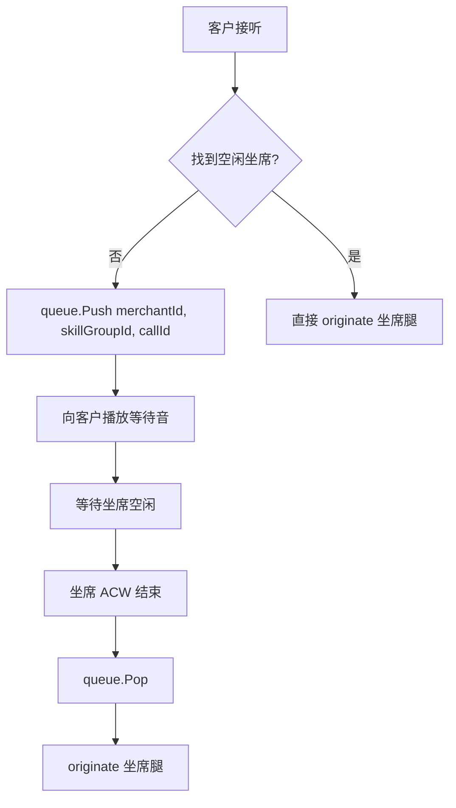
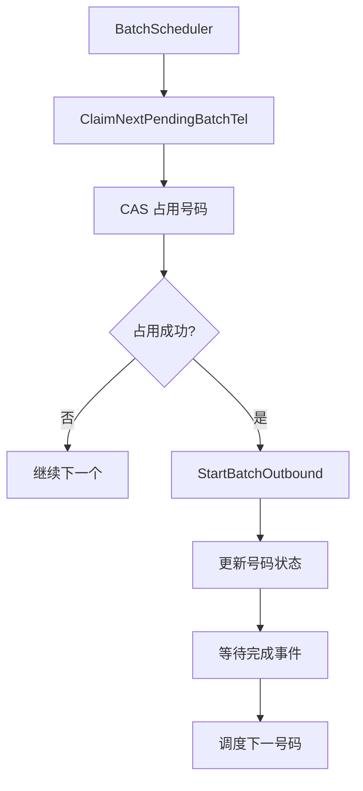

# 批量外呼

批量外呼用于任务式自动呼叫客户号码。

---

## 1. 模式

| 模式 | profile | 说明 |
| --- | --- | --- |
| 标准批量 | `batch_outbound` | 客户接听后呼坐席 |
| 预测外呼 | `batch_predictive` | 客户接听后动态找空闲坐席，无坐席可排队 |
| 协同外呼 | `batch_synergy` | 客户振铃即提前呼坐席 |

---

## 2. 关键流程



**详细流程：**
```text
BatchScheduler
  → ClaimNextPendingBatchTel
  → StartBatchOutbound
  → 客户腿 originate
  → 客户应答/振铃
  → 坐席腿 originate
  → bridge
  → terminal_event
  → 下一号码调度
```

---

## 3. 状态机

### 标准批量/预测外呼 (Customer-First)



### 协同外呼 (Early Agent)



---

## 4. 队列

预测外呼和呼入共用 `CallQueue`：



**Redis key：**
```text
cti:merchant:{merchantId}:queue:skill_group:{skillGroupId}
```

---

## 5. 批量调度器



**调度间隔：** 可配置，通常 100ms - 1s

**并发控制：**
- 商户级别并发
- 技能组级别并发
- 坐席级别并发

---

## 6. 创建批量任务 API

```http
POST /cti/batchTask/create
Host: cc-console:8080
Content-Type: application/json

{
  "merchantId": 1,
  "skillGroupId": 37,
  "name": "营销活动",
  "type": "batch_predictive",
  "tels": [
    "13800001111",
    "13800002222",
    "13800003333"
  ],
  "callerIds": ["01088886666"]
}
```

**响应示例：**
```json
{
  "code": 0,
  "message": "success",
  "data": {
    "batchTaskId": 1001
  }
}
```

---

## 7. 相关代码索引

| 功能 | 文件位置 |
| --- | --- |
| 批量调度器 | `internal/domain/callflow/batch_scheduler.go` |
| ESL 工作流定义 | `internal/domain/esl/workflows.go` |
| 呼出编排 | `internal/domain/esl/originate.go` |
| 事件消费者路由 | `internal/domain/callflow/consumer.go` |
| 呼叫队列 | `internal/domain/callflow/call_queue.go` |
