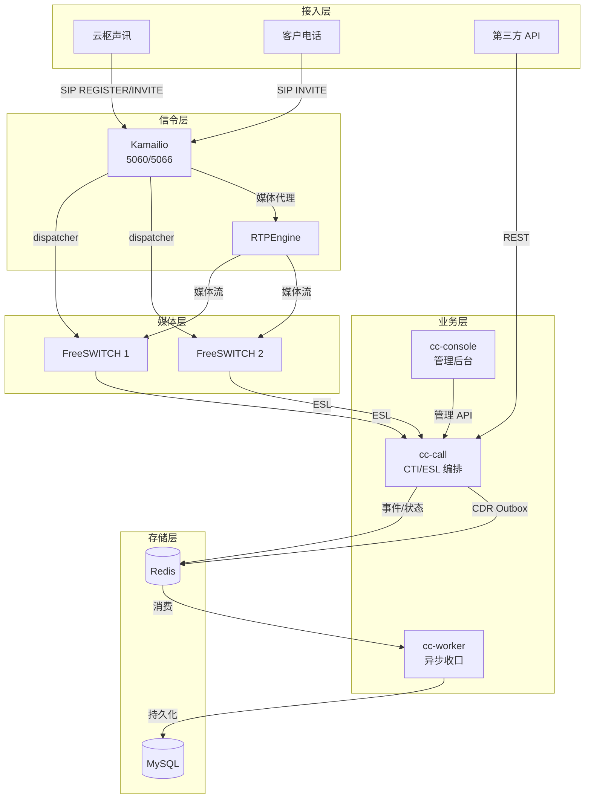
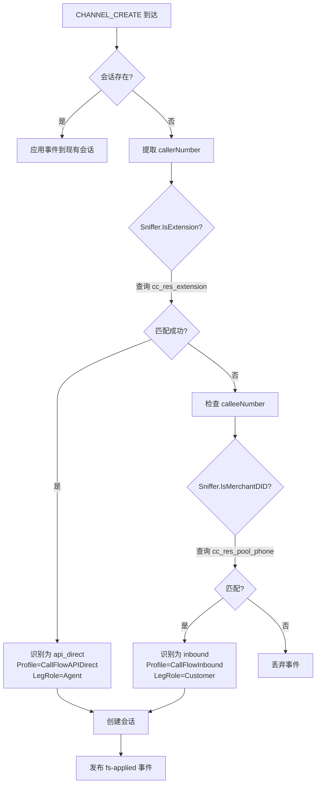
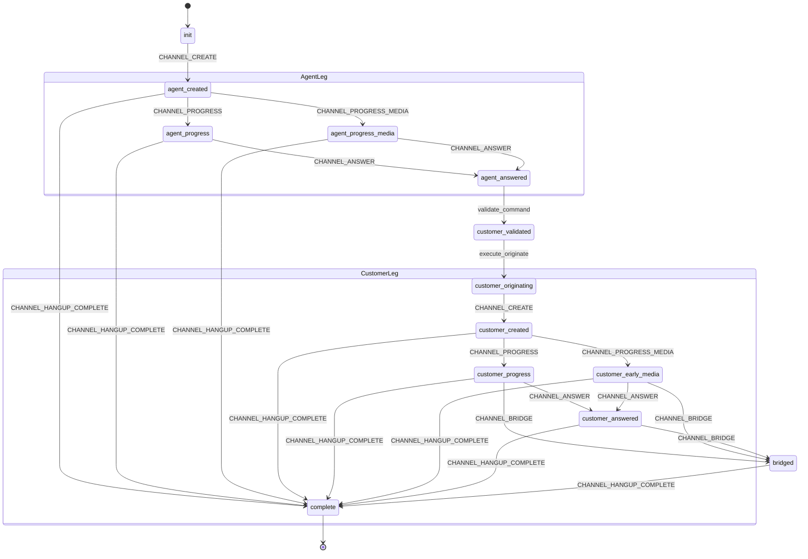
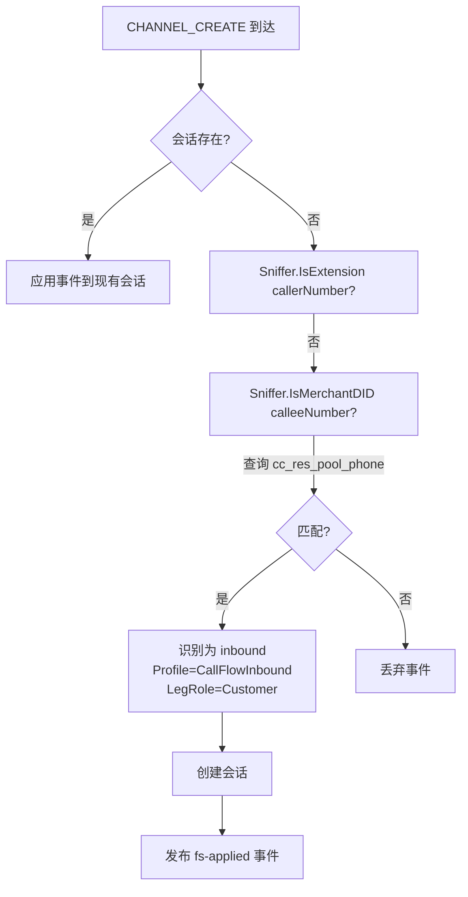
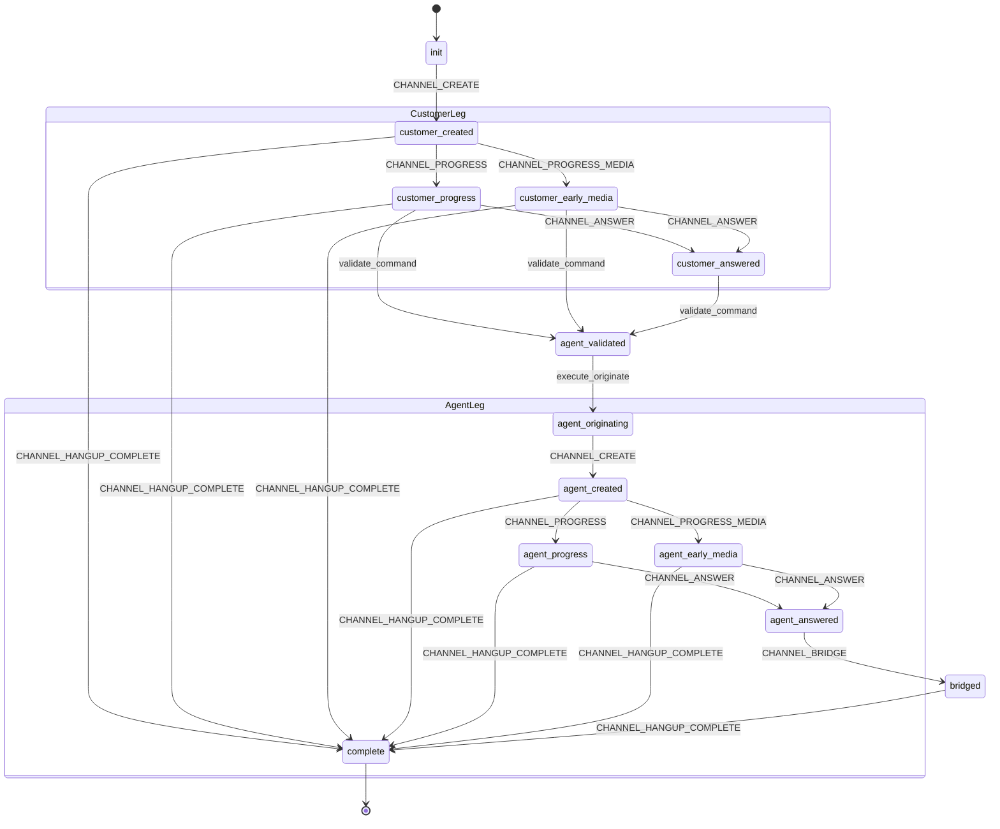
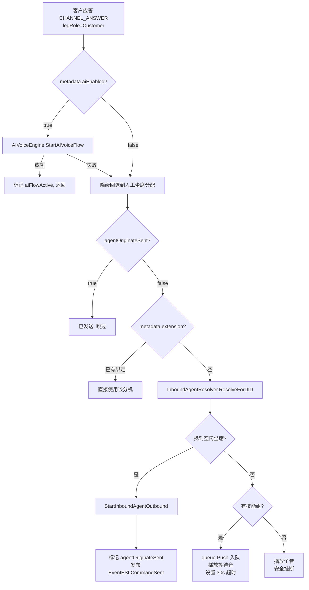
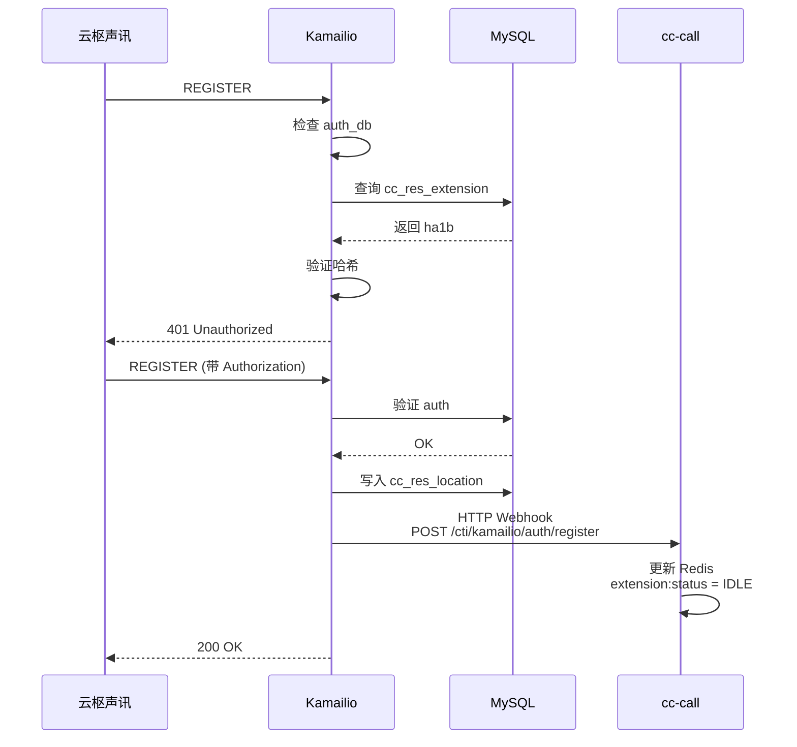

# 呼叫流程详解

本文档详细描述云枢声讯呼叫中心的核心话务流程，包括拨号盘直呼、客户呼入、API 外呼和批量外呼。

---

## 1. 系统话务拓扑总览



### 服务职责

| 组件 | 职责 |
|---|---|
| **Kamailio** | SIP 注册/鉴权，dispatcher 负载均衡到 FreeSWITCH，RTPEngine NAT 穿越 |
| **FreeSWITCH** | B2BUA 媒体服务器，执行 originate/bridge/hangup/playback，通过 park 等待 cc-call 编排 |
| **cc-call** | Go 话务引擎，消费 FS ESL 事件，驱动 CTI/ESL 工作流，管理会话和选号 |
| **cc-worker** | 异步收口服务，处理 CDR 持久化、计费、录音归档、Webhook 回调 |

---

## 2. 呼出流程 — 拨号盘直呼 (esl_dialpad_direct)

### 2.1 触发方式

坐席在云枢声讯拨号盘输入客户号码并发起呼叫 → SIP INVITE → Kamailio → dispatcher 转发 FreeSWITCH → dialplan `01_yunshu_inbound.xml` 匹配并 `&park()` → `CHANNEL_CREATE` 事件到达 cc-call。

### 2.2 会话自动识别

当 `CHANNEL_CREATE` 到达但会话不存在时，`SessionService.ApplyEvent()` 调用 `SessionSniffer` 自动识别来电类型：



**识别入口：** `internal/domain/esl/session.go:179-246`

### 2.3 ESL 状态机

**工作流 ID：** `esl_dialpad_direct`（`internal/domain/esl/workflows.go:150-189`）



### 2.4 事件处理序列

| 步骤 | 触发事件 | 处理函数 | 关键动作 |
|:---:|---|---|---|
| 1 | Phone INVITE → FS `CHANNEL_CREATE` | `SessionService.ApplyEvent()` | Sniffer 识别分机号，创建 `api_direct` 会话，`LegRole=Agent`，发布 `fs-applied` 事件 |
| 2 | `fs-applied` → ESL Runner | `consumer.go` 订阅 | 工作流从 `init` → `agent_created` |
| 3 | FS `CHANNEL_ANSWER`（坐席摘机） | `handleDialpadAgentAnswer()` | ① 检查 `customerOriginateSent` 幂等 ② `loadAPICandidates()` 加载可选号码 ③ `RuntimeSelector.SelectAndClaim()` 选号并占并发槽位 ④ `StartDialpadCustomerOutbound()` 发起客户腿 originate |
| 4 | 选号失败安全收口 | `hangupAgent()` 闭包 | 下发 `hangup` 命令切断坐席通道，释放并发槽位 |
| 5 | FS `CHANNEL_CREATE`（客户腿） | `ApplyEvent()` | UUID 映射到 `LegRole=Customer` |
| 6a | FS `CHANNEL_PROGRESS`（客户 180 振铃） | `handleDialpadCustomerProgress()` | 向坐席腿播放补振铃音（`MediaOrchestrator`） |
| 6b | FS `CHANNEL_PROGRESS_MEDIA`（客户 183 早期媒体） | `handleDialpadCustomerEarlyMedia()` | 停止补振铃，标记 `carrierEarlyMedia=true`，标记客户就绪，尝试桥接 |
| 7 | FS `CHANNEL_ANSWER`（客户接听） | `handleDialpadCustomerReady()` | 停止补振铃，标记 `customerReady=true` |
| 8 | 两腿均就绪 | `maybeBridgeDialpadDirect()` | `bridgeGuard` CAS 防重 → FS `uuid_bridge` 合并通话 |
| 9 | FS `CHANNEL_HANGUP_COMPLETE` | `ApplyEvent()` | ① 写 CDR outbox ② 释放运行时选号并发槽位 ③ 5s ACW 冷却后恢复分机 IDLE ④ 检查排队队列 |

### 2.5 关键设计特性

- **Agent-First 语义**：先呼坐席分机，坐席摘机后再选号呼客户
- **选号失败安全收口**：`hangupAgent()` 闭包确保坐席不会无限等待
- **补振铃音编排**：`MediaOrchestrator` 管理 `broadcastTime` 定时截断，运营商 183 到达自动停播
- **bridgeGuard 防重**：`sync.Map.LoadOrStore` 确保 `uuid_bridge` 只执行一次
- **ACW 冷却**：坐席挂断后 5s 冷却期，防止二次派单；冷却后检查排队队列拉取等待呼叫
- **幂等保护**：`customerOriginateSent` / `lastEventID` 防止重复起呼和重复事件

---

## 3. 呼入流程 — 客户呼入 (esl_inbound)

### 3.1 触发方式

外部客户拨打商户 DID 号码 → SIP INVITE 到达 Kamailio(5060) → 鉴权通过 → dispatcher 负载均衡到 FreeSWITCH → 匹配 dialplan `01_yunshu_inbound.xml` → `answer` + `park` → `CHANNEL_CREATE` 事件到达 cc-call。

### 3.2 会话自动识别



### 3.3 ESL 状态机

**工作流 ID：** `esl_inbound`（`internal/domain/esl/workflows.go:190-231`）



### 3.4 事件处理序列

| 步骤 | 触发事件 | 处理函数 | 关键动作 |
|:---:|---|---|---|
| 1 | 客户 INVITE → FS `CHANNEL_CREATE` | `SessionService.ApplyEvent()` | Sniffer 识别 DID，创建 `inbound` 会话，`LegRole=Customer`，发布 `fs-applied` 事件 |
| 2 | `fs-applied` → ESL Runner | `consumer.go` 订阅 | 工作流从 `init` → `customer_created` |
| 3 | FS `CHANNEL_ANSWER`（dialplan answer + park） | `handleInboundCustomerAnswer()` | 见下方详细分支（含无坐席安全挂断） |
| 4 | FS `CHANNEL_CREATE`（坐席腿） | `ApplyEvent()` | UUID 映射到 `LegRole=Agent` |
| 5 | FS `CHANNEL_PROGRESS`（坐席振铃） | `handleInboundAgentProgress()` + 分机状态更新 | ① 向客户播放回铃音 ② Redis `extension:status` → `Ringing` |
| 6 | FS `CHANNEL_ANSWER`（坐席摘机） | `handleInboundAgentReady()` | 停止回铃音，标记 `agentAnswered=true`，触发 `maybeBridgeInbound()` |
| 7 | 两腿均就绪 | `maybeBridgeInbound()` | `bridgeGuard` CAS 防重 → FS `uuid_bridge` 合并通话 |
| 8 | FS `CHANNEL_HANGUP_COMPLETE` | `ApplyEvent()` | 写 CDR outbox，释放资源，ACW 冷却 |

### 3.5 坐席分配链路

`handleInboundCustomerAnswer()`（`consumer.go:1883-1977`）的处理分支：



### 3.6 坐席分配查询（InboundAgentResolver）

**代码位置：** `internal/infra/resource/inbound_agent_resolver.go:41-95`

```sql
SELECT u.id AS user_id, u.merchant_id, u.seat_number, e.extension_number
FROM cc_res_pool_phone pp
INNER JOIN cc_res_pool_phone_skill_group ppsg ON ppsg.pool_phone_id = pp.id
INNER JOIN cc_res_skill_group sg ON sg.id = ppsg.skill_group_id AND sg.enable = 1 AND sg.del_flag = 0
INNER JOIN cc_res_user_skill_group usg ON usg.skill_group_id = sg.id
INNER JOIN cc_res_mch_user u ON u.id = usg.user_id AND u.enable = 1 AND u.del_flag = 0
INNER JOIN cc_res_extension e ON e.user_id = u.id AND e.enable = 1 AND e.del_flag = 0
WHERE pp.phone = ? AND pp.enable = 1 AND pp.del_flag = 0 AND u.merchant_id = ?
ORDER BY u.id ASC
```

查询后逐个检查 Redis `extension:status`，返回第一个 `IDLE` 的坐席。

---

## 4. 两条流程对比

| 维度 | 呼出（拨号盘直呼） | 呼入（客户呼入） |
|---|---|---|
| **发起方** | 坐席（云枢声讯） | 外部客户 |
| **触发方式** | 坐席在拨号盘拨号 | 客户拨打商户 DID |
| **会话识别** | Sniffer 匹配 caller → `cc_res_extension` | Sniffer 匹配 callee → `cc_res_pool_phone` |
| **Profile** | `CallFlowAPIDirect` | `CallFlowInbound` |
| **ESL 工作流** | `esl_dialpad_direct` | `esl_inbound` |
| **Leg A（先呼）** | 坐席分机（Agent-First） | 客户（Customer-First） |
| **Leg B（后呼）** | 客户电话（经选号网关出局） | 坐席分机（内部 Sofia 注册） |
| **选号** | `RuntimeSelector` 动态选号，占用并发槽位 | 无需选号，直接呼分机 |
| **坐席分配** | 拨号坐席本身 | `InboundAgentResolver` 按 DID→技能组查找 |
| **AI 话术** | 不涉及 | 客户应答时可触发 AI Voice Engine |
| **关键入口函数** | `handleDialpadAgentAnswer()` | `handleInboundCustomerAnswer()` |
| **桥接函数** | `maybeBridgeDialpadDirect()` | `maybeBridgeInbound()` |
| **补振铃音** | ✅ 完整（MediaOrchestrator + broadcastTime） | ✅ 回铃音（`handleInboundAgentProgress`） |
| **无坐席处理** | N/A（单次呼出） | ✅ 入队等待 / 超时挂断 / 降级安全挂断 |
| **ACW 冷却** | ✅ 5s + 排队拉取 | ✅ 5s + 拉取呼入排队客户 |

---

## 5. SIP 注册流程

云枢声讯通过 Kamailio 完成 SIP 注册，这是呼出和呼入的前置条件：



**Kamailio 配置要点（`configs/kamailio/kamailio.cfg`）：**
- `auth_db` 模块：`calculate_ha1=0`，`use_domain=1`，`password_column_2=ha1b`
- `dispatcher` 模块：从 `cc_res_freeswitch` 表加载 FS 节点列表
- WebSocket 支持：端口 5066 供 WebRTC 软电话使用

**FreeSWITCH 入口拨号计划（`docker/freeswitch/conf/dialplan/public/01_yunshu_inbound.xml`）：**
```xml
<extension name="yunshu_inbound">
  <condition field="destination_number" expression="^.*$">
    <action application="answer"/>
    <action application="park"/>
  </condition>
</extension>
```
所有经 Kamailio 转发到 FreeSWITCH 的 INVITE 都会被 answer + park，等待 cc-call 通过 ESL 编排后续流程。

---

## 6. 其余呼叫流程概览

除云枢声讯的拨号盘直呼和客户呼入外，系统还支持以下呼叫流程：

| 流程 | ESL 工作流 | 语义 | 触发方式 | 状态 |
|---|---|---|---|---|
| API 外呼 | `esl_api_outbound` | Agent-First | REST API `POST /cti/callTask/call` | ✅ 完整 |
| 批量外呼 | `esl_batch_outbound` | Customer-First | 批量调度器 CAS 分配号码 | ✅ 完整 |
| 批量预测外呼 | `esl_batch_predictive` | Customer-First | 批量调度器 + 排队队列 | ✅ 完整 |
| 批量协同外呼 | `esl_batch_synergy` | Customer-First（振铃即起呼坐席） | 批量调度器 | ✅ 完整 |
| 拨号盘直呼 | `esl_dialpad_direct` | Agent-First | 云枢声讯拨号 | ✅ 完整 |
| 客户呼入 | `esl_inbound` | Customer-First | 外部客户拨打 DID | ✅ 完整 |

---

## 7. 相关代码索引

| 功能 | 文件位置 |
| --- | --- |
| ESL 工作流定义 | `internal/domain/esl/workflows.go` |
| 会话管理核心 | `internal/domain/esl/session.go` |
| 呼出编排 | `internal/domain/esl/originate.go` |
| 事件消费者路由 | `internal/domain/callflow/consumer.go` |
| 会话嗅探器 | `internal/infra/resource/session_sniffer.go` |
| 坐席分配器 | `internal/infra/resource/inbound_agent_resolver.go` |
| ESL 事件适配 | `internal/infra/fsesl/event_adapter.go` |
| ESL 命令构建 | `internal/infra/fsesl/command_builder.go` |
