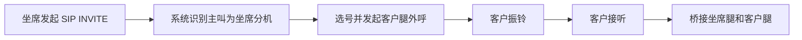
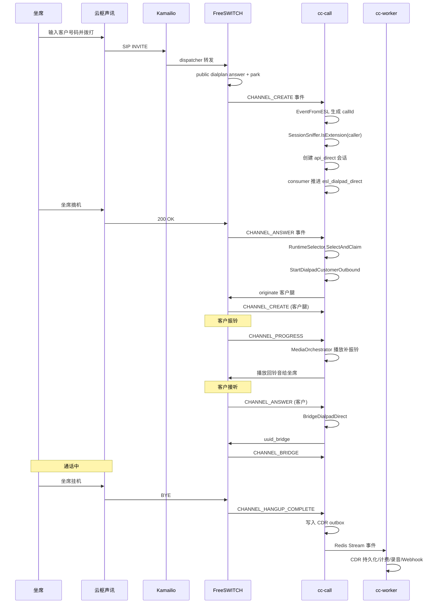
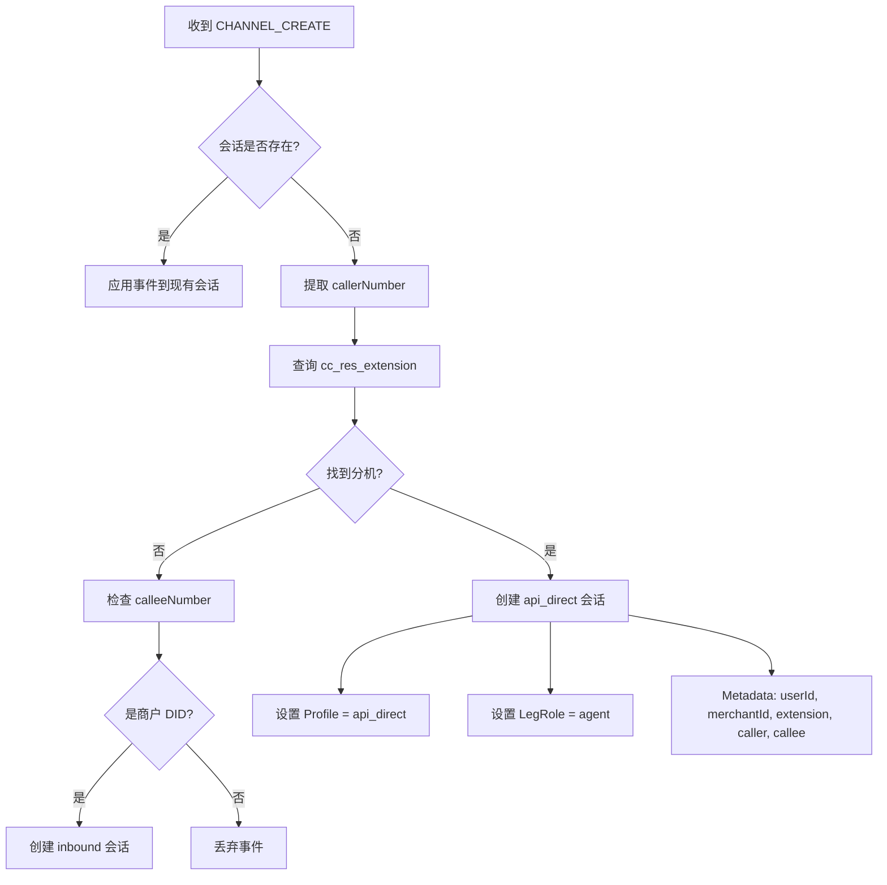
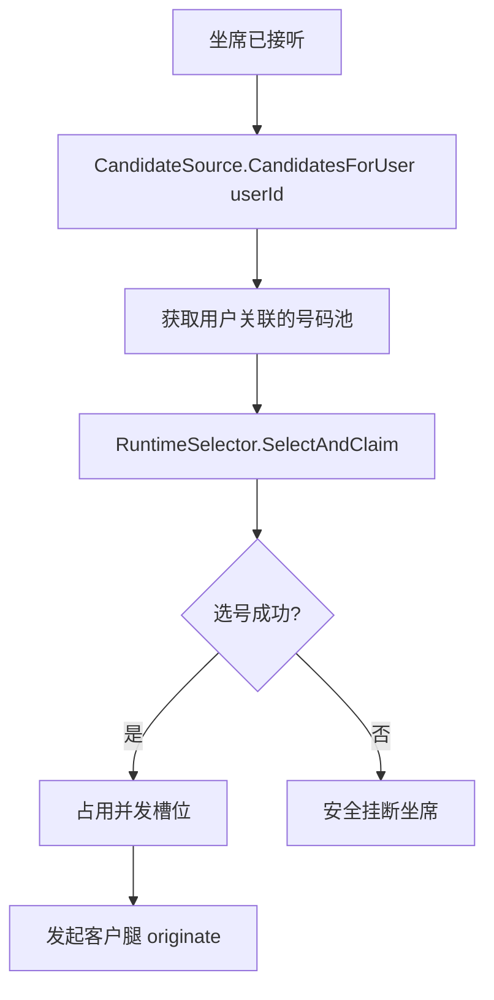
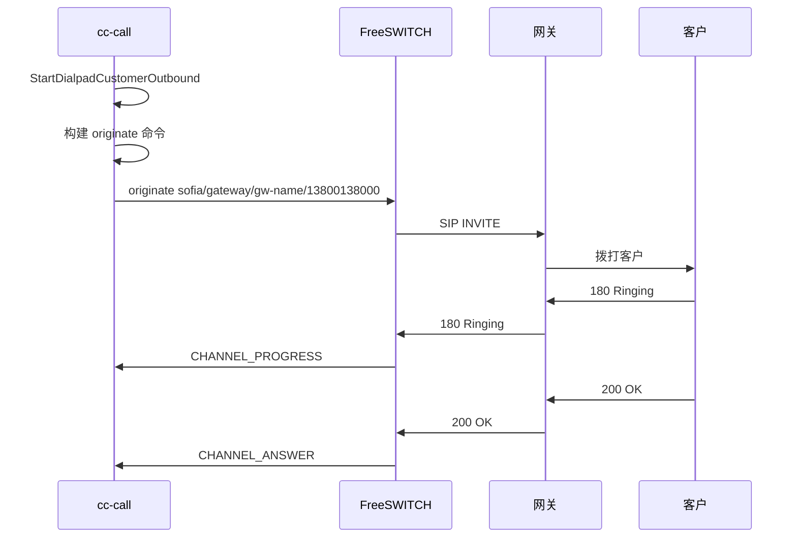
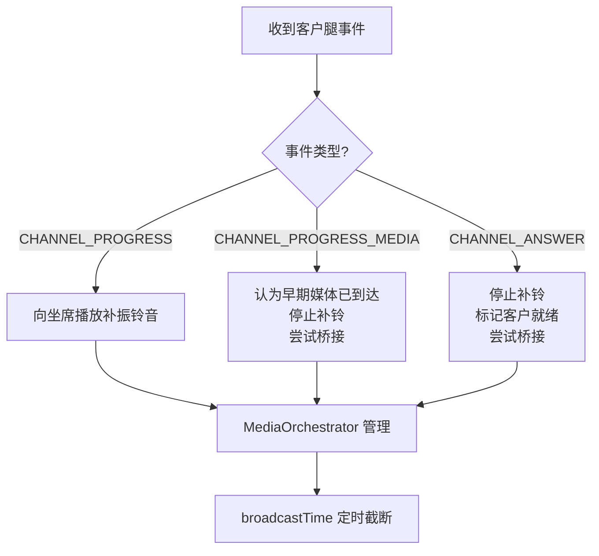
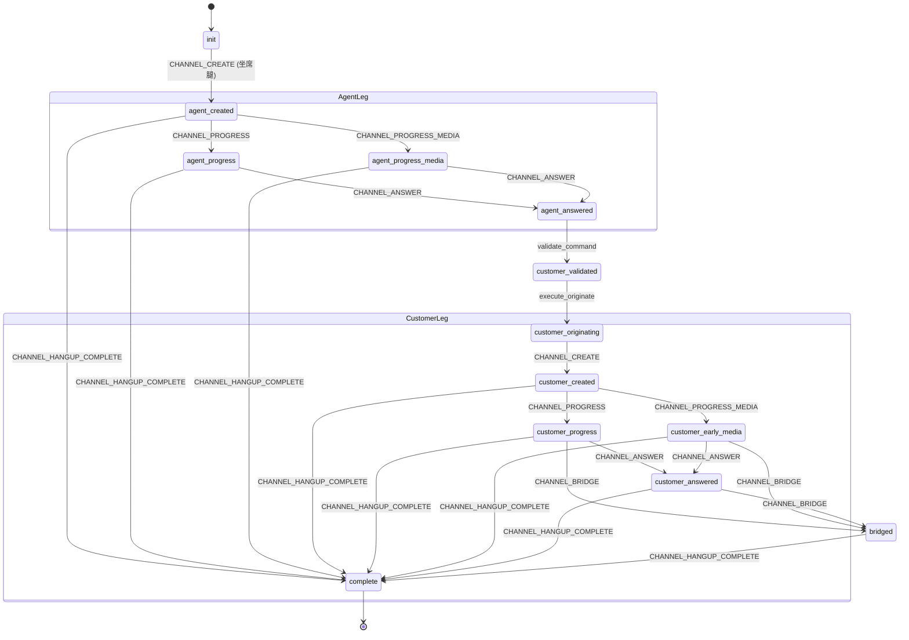
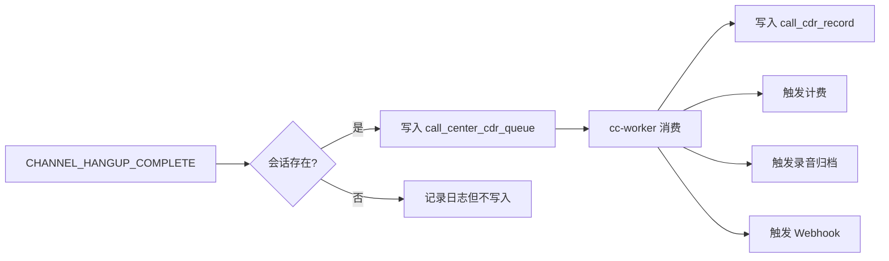

# 云枢声讯呼出

云枢声讯呼出是指坐席通过云枢声讯主动拨打客户电话。

对应 ESL 工作流：`esl_dialpad_direct`

---

## 1. 业务语义

云枢声讯直呼属于 **Agent-First** 语义：



详细流程：
1. 坐席先发起 SIP INVITE。
2. 云枢声讯识别主叫为坐席分机。
3. 系统再进行号码选择和客户腿外呼。
4. 客户接听后桥接坐席腿和客户腿。

---

## 2. 完整流程



---

## 3. 会话识别

当物理呼叫没有云枢声讯 callId 时，系统使用 FreeSWITCH `Unique-ID` 兜底。

`SessionSniffer` 会先检查主叫是否为分机：



**SQL 查询：**
```sql
SELECT * FROM cc_res_extension
WHERE extension_number = callerNumber
  AND enable = 1
  AND del_flag = 0;
```

---

## 4. 选号

云枢声讯直呼使用和 API 外呼相同的候选号码源：



选号会考虑：
- 号码是否启用
- 网关是否启用
- 技能组绑定
- 黑白名单
- 盲区规则
- 号码/网关并发

**选号入口：**
```
RuntimeSelector.SelectAndClaim(callId, merchantId, userId, callee)
```

---

## 5. 客户腿 originate

客户腿通过所选网关或 IP 直连呼出：



**写入 metadata：**
```json
{
  "customerOriginateSent": true,
  "selectedCaller": "01088886666",
  "selectedGatewayId": "44",
  "customerUuid": "..."
}
```

---

## 6. 补振铃音

客户侧 180/183 到达后：



- **180**：可向坐席侧播放补振铃
- **183**：认为客户侧早期媒体已到达，停止补铃并尝试桥接

媒体编排由 `MediaOrchestrator` 管理。

---

## 7. 状态机



如果 FreeSWITCH public dialplan 只 park 坐席腿，系统也可以从 `CHANNEL_CREATE` 触发客户腿起呼。

---

## 8. CDR

无论客户腿是否成功，只要会话最终收到 `CHANNEL_HANGUP_COMPLETE`，都会写入：



例如客户腿失败、坐席取消、选号失败，都应有通话记录。

---

## 9. 验证

```bash
bash scripts/sipp/run_e2e_tests.sh dialpad
```

如果本机出现 UDP 路由问题：

```text
Unable to send UDP message: No route to host
```

建议使用：

```bash
SIPP_UAS_MODE=docker bash scripts/sipp/run_e2e_tests.sh dialpad
```

或在 Linux 服务器部署后验证。

---

## 10. 常见故障

### 未进入 api_direct

检查事件别名：
- `callerNumber`
- `calleeNumber`
- `Caller-Caller-ID-Number`
- `Caller-Destination-Number`

### 没有发起客户腿

检查：
- 是否捕获到 `api_direct`
- 分机是否有 userId
- CandidateSource 是否有候选号码
- 风控表是否存在
- 选号是否成功

### 客户 UAS 不回包

本地 Docker Desktop 常见，需要容器内 UAS 或服务器环境。

---

## 11. 相关代码索引

| 功能 | 文件位置 |
| --- | --- |
| ESL 工作流定义 | `internal/domain/esl/workflows.go` |
| 会话管理核心 | `internal/domain/esl/session.go` |
| 呼出编排 | `internal/domain/esl/originate.go` |
| 事件消费者路由 | `internal/domain/callflow/consumer.go` |
| 会话嗅探器 | `internal/infra/resource/session_sniffer.go` |
| 运行时选号器 | `internal/infra/selection/runtime_selector.go` |
| 媒体编排器 | `internal/domain/esl/media_orchestrator.go` |
