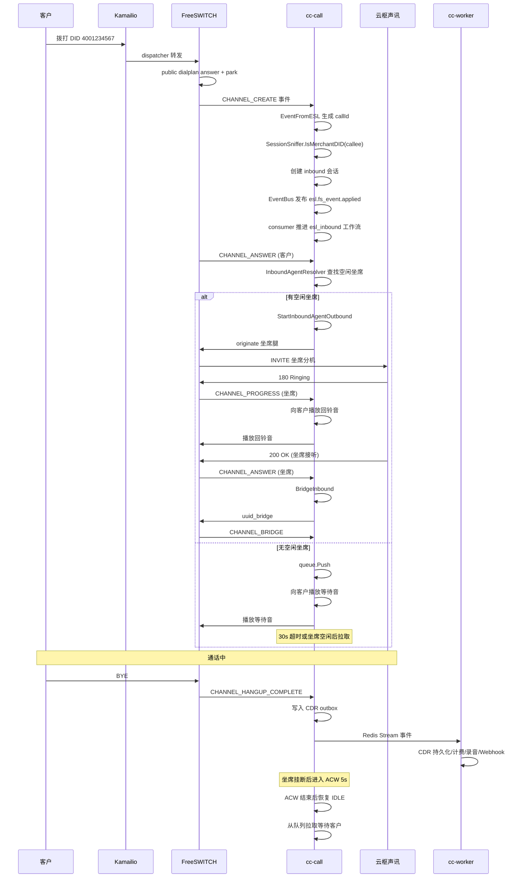
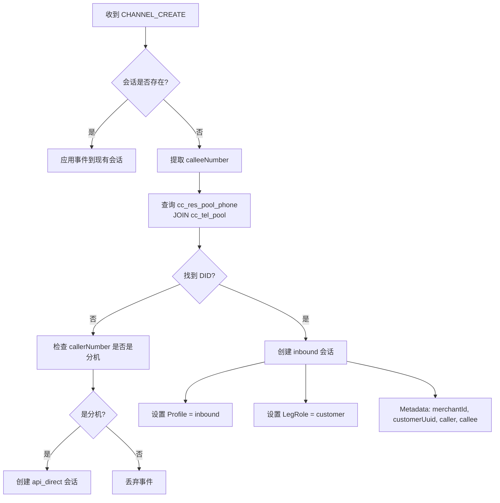
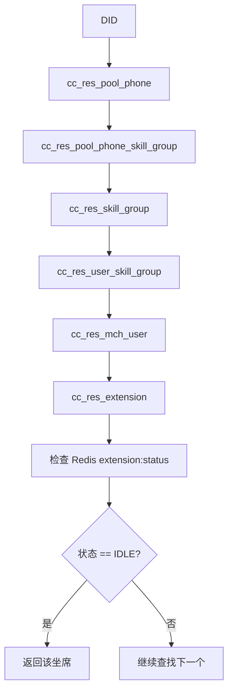
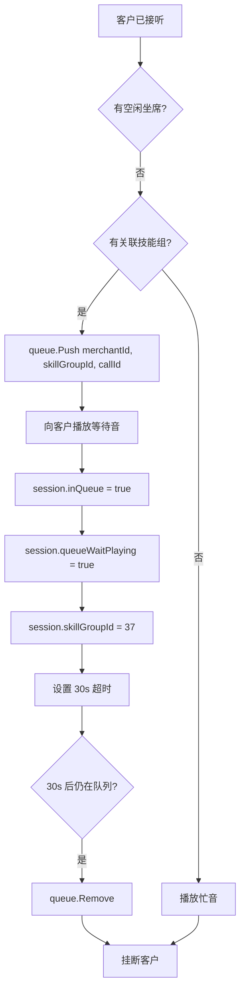
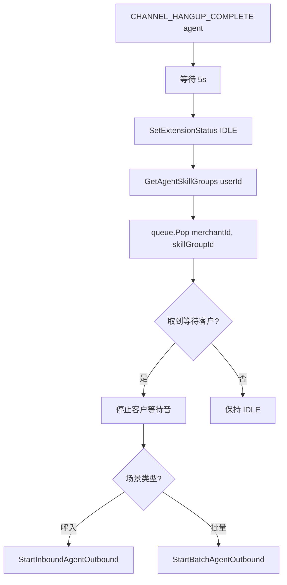
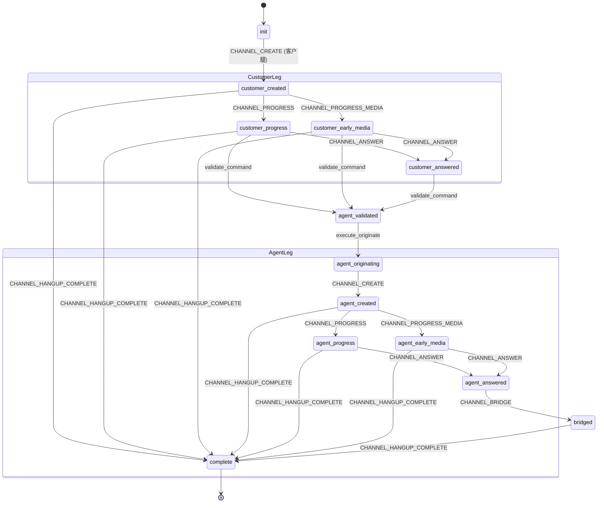
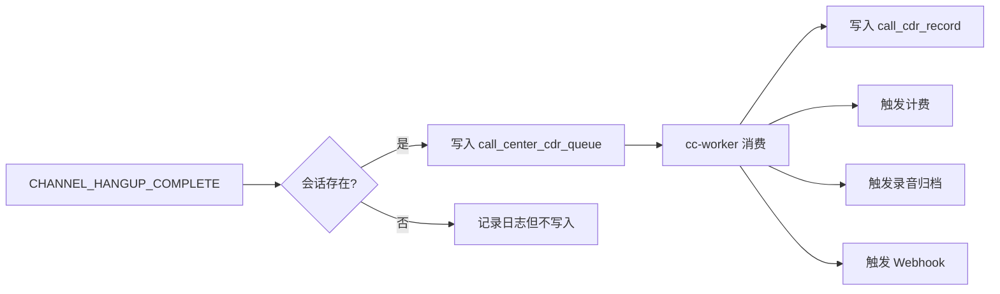

# 客户呼入

客户呼入是指外部客户拨打商户 DID，系统自动分配坐席或进入排队。

对应 ESL 工作流：`esl_inbound`

---

## 1. 完整流程



---

## 2. DID 识别

`SessionSniffer` 会检查被叫号码是否是商户 DID：



**SQL 查询：**
```sql
SELECT pp.*, p.merchant_id
FROM cc_res_pool_phone pp
JOIN cc_tel_pool p ON p.id = pp.pool_id
WHERE pp.phone = ?
  AND pp.enable = 1
  AND pp.del_flag = 0;
```

如果命中，创建：
```text
Profile = inbound
LegRole = customer
Metadata = merchantId, customerUuid, caller, callee
```

---

## 3. 坐席分配

`InboundAgentResolver` 查询链路：



**SQL 查询：**
```sql
SELECT u.id AS user_id, u.merchant_id, u.seat_number, e.extension_number
FROM cc_res_pool_phone pp
INNER JOIN cc_res_pool_phone_skill_group ppsg ON ppsg.pool_phone_id = pp.id
INNER JOIN cc_res_skill_group sg ON sg.id = ppsg.skill_group_id AND sg.enable = 1 AND sg.del_flag = 0
INNER JOIN cc_res_user_skill_group usg ON usg.skill_group_id = sg.id
INNER JOIN cc_res_mch_user u ON u.id = usg.user_id AND u.enable = 1 AND u.del_flag = 0
INNER JOIN cc_res_extension e ON e.user_id = u.id AND e.enable = 1 AND e.del_flag = 0
WHERE pp.phone = ? AND pp.enable = 1 AND pp.del_flag = 0 AND u.merchant_id = ?
ORDER BY u.id ASC
```

之后检查 Redis：
```text
HGET extension:status 1001
```

只有状态为 `IDLE(1)` 的分机会被分配。

---

## 4. 无坐席排队

如果 DID 关联技能组，但没有空闲坐席：



**Redis key：**
```text
cti:merchant:{merchantId}:queue:skill_group:{skillGroupId}
```

同时 session 写入：
```json
{
  "inQueue": true,
  "queueWaitPlaying": true,
  "skillGroupId": 37
}
```

30 秒后如果仍在队列：
```text
queue.Remove → hangup customer
```

---

## 5. ACW 后拉取

坐席挂断后不会立即变空闲，而是进入 ACW：



**流程：**
```text
CHANNEL_HANGUP_COMPLETE(agent)
  → 等待 5s
  → SetExtensionStatus(IDLE)
  → GetAgentSkillGroups(userId)
  → queue.Pop(merchantId, skillGroupId)
```

如果取到等待客户：
- 停止客户等待音
- 起呼坐席腿
- 呼入场景走 `StartInboundAgentOutbound`
- 批量场景走 `StartBatchAgentOutbound`

---

## 6. 坐席腿路由

坐席腿必须走 Kamailio location：

```mermaid
graph LR
    A[cc-call] --> B[originate 坐席腿]
    B --> C[sofia/external/1001@sip.merchant.yunshu.com]
    C --> D[;fs_path=sip:192.168.107.2:5060]
    D --> E[X-Internal-Call: true]
    E --> F[Kamailio]
    F --> G[查找 location 表]
    G --> H[转发到坐席实际地址]
```

**SIP URI 格式：**
```text
sofia/external/1001@sip.merchant.yunshu.com;fs_path=sip:192.168.107.2:5060
```

并携带：
```text
X-Internal-Call: true
```

否则 Kamailio 会把呼叫重新 dispatcher 到 FreeSWITCH，或因域不匹配返回 404。

---

## 7. 状态机



---

## 8. CDR

呼入只要最终收到：
```text
CHANNEL_HANGUP_COMPLETE
```

就会写入：


并最终落库到：
```text
call_cdr_record
```

---

## 9. 验证

```bash
bash scripts/sipp/run_e2e_tests.sh inbound
```

成功输出：
```text
PASS: 呼入 - 客户侧完整信令 (INVITE→200 OK→ACK→BYE)
```

---

## 10. 常见故障

### 呼入一直超时

检查 FreeSWITCH 是否上报 `CHANNEL_CREATE`：
```bash
docker logs cc-freeswitch | grep CHANNEL_CREATE
```

### cc-call 没有自动捕获 inbound

检查 `EventFromESL` 是否生成 callId，DID 是否存在：
```sql
SELECT pp.phone, p.merchant_id
FROM cc_res_pool_phone pp
JOIN cc_tel_pool p ON p.id = pp.pool_id
WHERE pp.phone='01088886666';
```

### 坐席腿 UNALLOCATED_NUMBER

检查 R-URI 域是否为：
```text
sip.merchant.yunshu.com
```

---

## 11. 相关代码索引

| 功能 | 文件位置 |
| --- | --- |
| ESL 工作流定义 | `internal/domain/esl/workflows.go` |
| 会话管理核心 | `internal/domain/esl/session.go` |
| 呼出编排 | `internal/domain/esl/originate.go` |
| 事件消费者路由 | `internal/domain/callflow/consumer.go` |
| 会话嗅探器 | `internal/infra/resource/session_sniffer.go` |
| 坐席分配器 | `internal/infra/resource/inbound_agent_resolver.go` |
| 呼叫队列 | `internal/domain/callflow/call_queue.go` |
