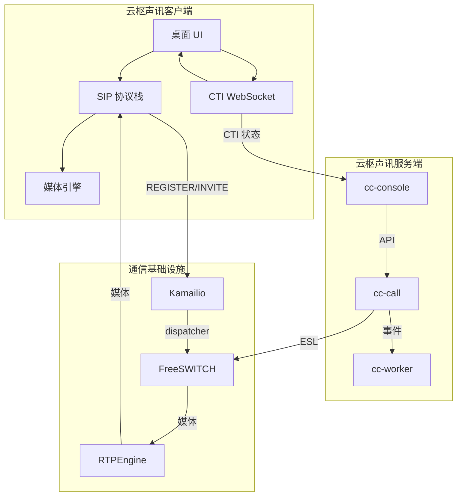
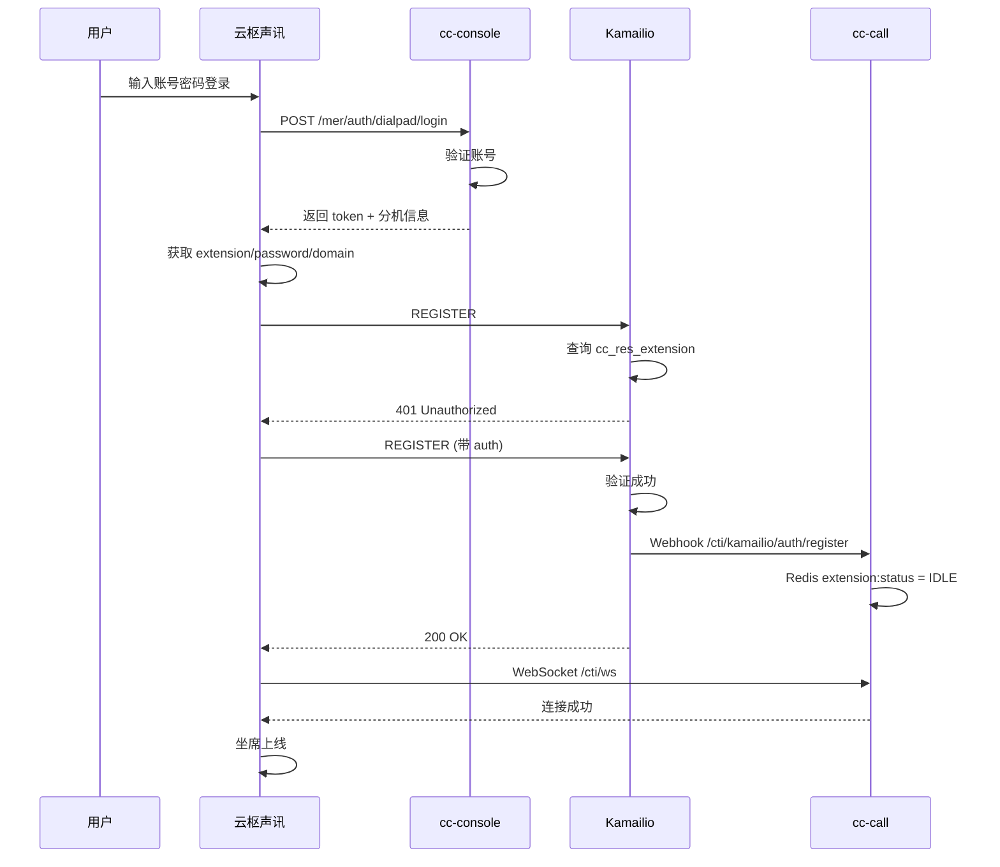
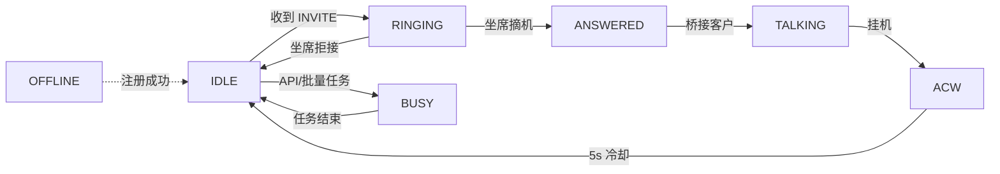
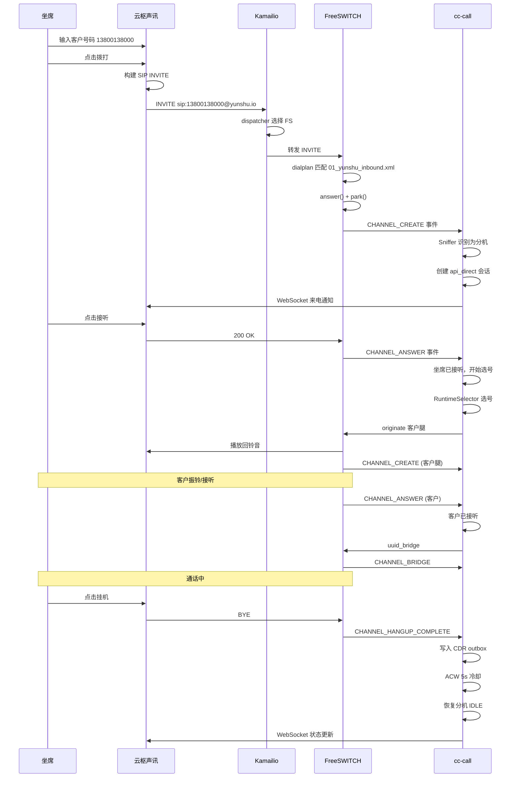
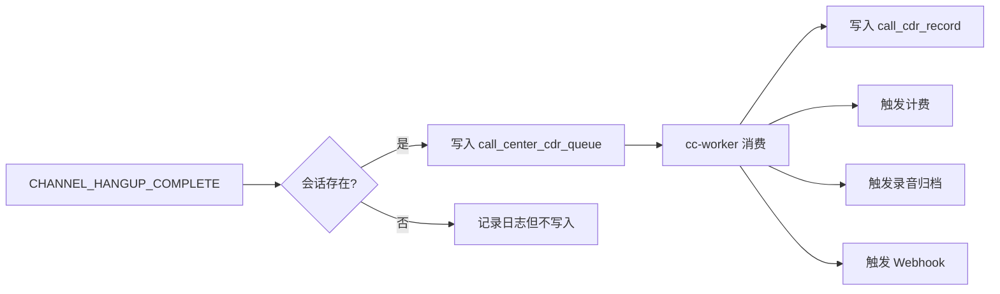

# 云枢声讯

云枢声讯是云枢声讯官方桌面客户端，通过 SIP 协议接入 Kamailio，由云枢声讯后端完成 CTI/ESL 业务编排。

---

## 1. 整体架构



---

## 2. 基本流程



---

## 3. 关键接口

| 功能 | 入口 | 方法 | 说明 |
| --- | --- | --- | --- |
| 云枢声讯登录 | `/mer/auth/dialpad/login` | POST | 获取访问令牌 |
| 获取分机信息 | `/mer/v1/user/dialpad/extensionInfo` | GET | 获取 SIP 注册配置 |
| CTI WebSocket | `/cti/ws` | WS | 实时状态同步 |
| SIP 注册 | Kamailio `5060/5066` | SIP | SIP REGISTER |

### 登录接口示例

**请求：**
```http
POST /mer/auth/dialpad/login
Content-Type: application/json

{
  "username": "agent001",
  "password": "password123"
}
```

**响应：**
```json
{
  "code": 0,
  "message": "success",
  "data": {
    "token": "eyJhbGciOiJIUzI1NiIsInR5cCI6IkpXVCJ9...",
    "user": {
      "id": 1001,
      "username": "agent001",
      "merchantId": 1
    },
    "extension": {
      "extensionNumber": "1001",
      "password": "sip_password",
      "domain": "yunshu.io",
      "outboundProxy": "sip.yunshu.io:5060"
    }
  }
}
```

### CTI WebSocket 消息

**坐席状态变化：**
```json
{
  "type": "extension_status",
  "data": {
    "extensionNumber": "1001",
    "status": "IDLE", // IDLE, RINGING, ANSWERED, BUSY, ACW, OFFLINE
    "timestamp": 1718000000
  }
}
```

**来电事件：**
```json
{
  "type": "incoming_call",
  "data": {
    "callId": "call-123456",
    "callerNumber": "13800138000",
    "calleeNumber": "4001234567",
    "skillGroupName": "客服一组",
    "timestamp": 1718000000
  }
}
```

---

## 4. 支持的呼叫场景

| 场景 | 说明 | 呼叫方向 |
| --- | --- | --- |
| 云枢声讯直呼 | 坐席从云枢声讯主动拨打客户号码 | 呼出 |
| 客户呼入 | 客户拨打商户 DID，系统分配坐席 | 呼入 |
| API 外呼 | 第三方或后台调用 API 发起外呼 | 呼出 |
| 批量外呼 | 系统按任务队列自动呼叫客户 | 呼出 |

---

## 5. 分机状态

### 状态枚举



### Redis 存储

Redis key 格式：`extension:status:{extensionNumber}`

状态值：

| 值 | 枚举 | 说明 |
| --- | --- | --- |
| -1 | OFFLINE | 离线/未注册 |
| 0 | IDLE | 空闲 |
| 1 | BUSY | 忙碌（不可分配） |
| 2 | RINGING | 振铃中 |
| 3 | ANSWERED | 已接听 |
| 4 | TALKING | 通话中 |
| 5 | ACW | 话后处理 |

---

## 6. 拨号盘直呼流程

坐席在云枢声讯上直接输入客户号码发起呼叫。



---

## 7. 通话记录保证

只要呼叫进入云枢声讯会话生命周期，并最终收到 `CHANNEL_HANGUP_COMPLETE`，系统都会写入 CDR outbox。



---

## 8. 相关代码索引

| 功能 | 文件位置 |
| --- | --- |
| 拨号盘登录接口 | `internal/transport/http/console/operate/dialpad_compat_routes.go` |
| SIP 注册 Webhook | `internal/transport/http/cti/kamailio_routes.go` |
| CTI WebSocket | `internal/transport/http/cti/websocket_handler.go` |
| 分机状态管理 | `internal/domain/extension/status_service.go` |
